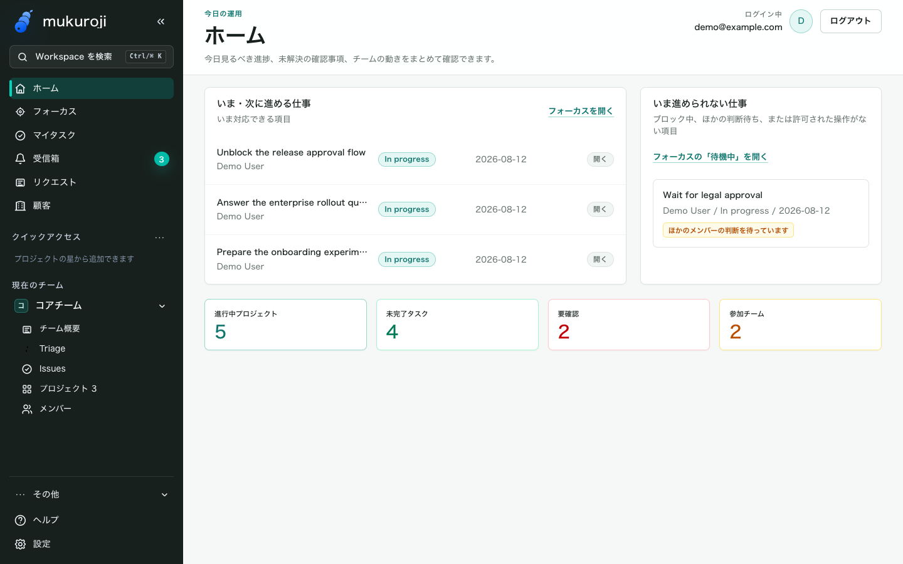
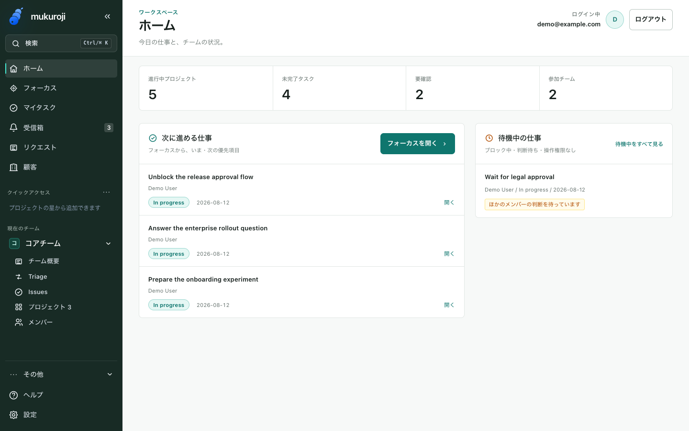
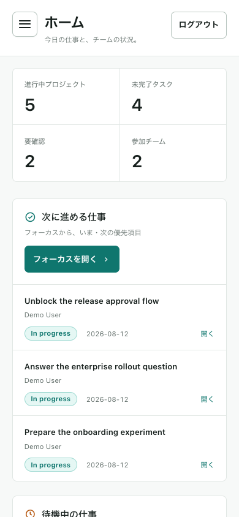
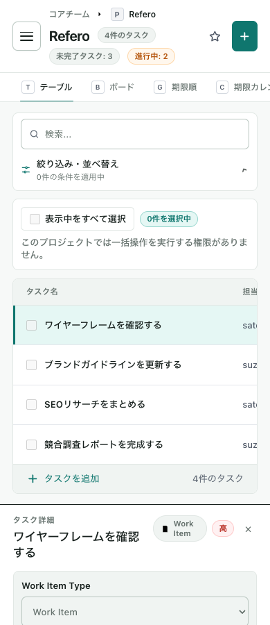
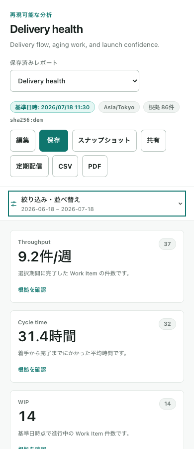
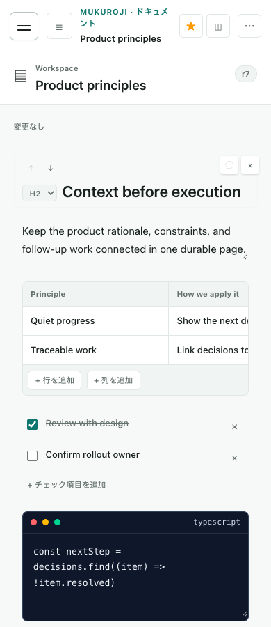
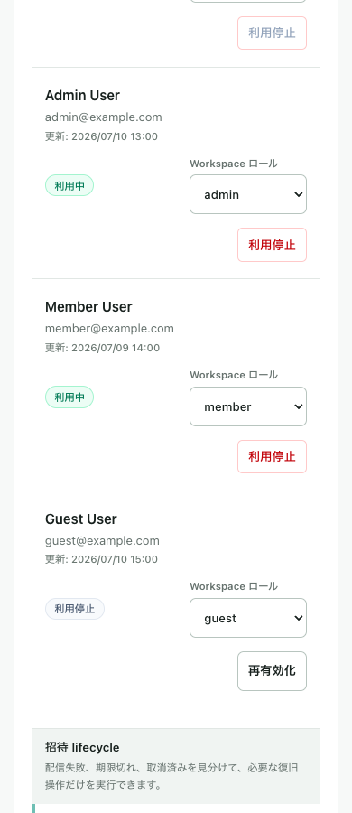

# Workspace UI refinement

The shared application shell and everyday work views now use a quieter hierarchy:
summary first, actionable work second, waiting work alongside it. A 256px forest-green
sidebar leaves more room for content, with a restrained selected state and unread badge.

## Design decisions

- Retain Mukuroji's brand mark and teal action color. Use neutral surfaces, fine borders,
  8px-or-smaller corners, and a consistent system-font stack. No decorative hero,
  gradients, new fonts, or icon dependency.
- Put Home metrics in a semantic definition list that switches from four columns to
  two on phones. Keep unavailable Focus values distinct from zero.
- Give Focus one primary action. Show complete task titles above status/date metadata;
  waiting items use separated rows instead of nested cards.
- Keep the mobile header compact, make the primary action and logout at least 44px high,
  retain drawer focus restoration, and give keyboard focus a visible outline.
- Use muted board lanes behind task cards. Shared metric cards elsewhere use a small
  semantic color marker instead of four competing colored borders.
- Keep existing routes, ranking, permissions, mutations, and translations' key names.
  Japanese and English wording was updated together.

Refero was unavailable in this session. No external-reference research is claimed;
the repository's `mukuroji-ui-design` fallback constraints guided these changes.

## Visual comparison

These images contain only existing Storybook fixture data, not production records.

### Before — 1440 × 900

### After — 1440 × 900

### After — 390 × 844

## Verification and reproduction

Run `bun install --frozen-lockfile`, then `bun run web:storybook` and open
`http://127.0.0.1:6006/iframe.html?id=application-pages-workspaceroutes--home-route&viewMode=story`.
The after images were captured with Playwright 1.60.0 using local headless Chrome.
The before image uses the same fixture via the recovered common-data-error shell at
base `ecd3ffbd`. Use the listed viewport sizes to reproduce the composition.

- Lint, production build, and Storybook build passed.
- Home (Japanese/English, empty, unavailable, loading), Dashboard, My Tasks, project
  Task Screen, and long-title rows were checked at 1440, 390, and 320px: 27 combinations,
  no document horizontal overflow or browser exceptions.
- Keyboard focus, sidebar collapse/expand, phone drawer Escape and focus restoration,
  primary Focus deep link, and reduced motion were checked in Chrome.
- Text contrast: muted text on white 5.08:1, teal on white 5.47:1, sidebar muted text
  7.22:1. Sidebar focus ring against its background: 10.06:1.
- Existing real-app workspace-session E2E: 7 passed, with local API stubs.
- Web unit tests: 1141 passed. AI review suites pin their clock within the fixed
  fixtures' retention window; a regression test verifies withholding at the deadline.
  This fixes 22 date-dependent failures also reproduced at the base commit.
  The Home assertion now verifies the link text independently
  of its decorative icon while preserving the Next-section deep-link check.

## Application-wide follow-up

The follow-up covers every application screen family through shared presentation and
targeted layout repairs. The initial cross-screen audit found defects already present
at the base: access management overflowed the phone viewport, a document table expanded
its editor grid, task dates overlapped the next column, and report filters displaced
the report content on phones. These are now corrected.

The design sequence is consistent across screens: identify the current scope, scan the
content, then filter or act. Search remains directly available; secondary task, project,
customer, and report controls use the same phone disclosure. Desktop controls remain visible.
Collapsing a disclosure preserves its input state. Shared surfaces use fine borders
without competing shadows; summary metrics use two columns on phones. Member roles
and actions remain visible in a stacked ledger, and project names wrap in directory
rows. The public document header wraps its language, export, and sign-in controls.
Workflow selectors keep their full width above the add/remove actions, and workload
forms use the same responsive inputs and action colors as the rest of the application.

The Refero capability remained unavailable. The follow-up uses the same documented
fallback rules and the rendered baseline as its reference. Data visualizations retain
semantic colors; boards and tables retain intentional local scrolling. This is a UI
change, with no new dependencies, backend changes, or permission changes.

### Screen coverage

The static Storybook build is checked at 1440 × 900, 390 × 900, and 320 × 900.
The coverage manifest in [application-ui-coverage.json](workspace-ui/application-ui-coverage.json)
records each story, viewport, browser error, and document width. It includes every
Storybook family and representative empty, error, read-only, and English variants.

| Application routes / surfaces | Representative Storybook coverage |
| --- | --- |
| Login, SSO callback, recovery, password reset | LoginPage, Enterprise SSO Callback, Security Recovery, Public Pages |
| Home, dashboard, My Tasks, inbox, help | WorkspaceRoutes and Workspace Help |
| Focus and personal/team policy | Focus Queue, Focus Policy |
| Teams, members, projects | WorkspaceRoutes and ProjectDirectoryView |
| Team issues and project tasks | Issue Page, Task Screen; table, board, calendar, files, permissions, creation and detail |
| Triage and request intake | Team Workbench, Intake Page, Public Form |
| Customers and impact | CustomerDirectoryView, Customer Impact Panel |
| Search and saved views | Search Results, Command Menu, View Toolbar; real-route Search E2E |
| Timeline, roadmap, portfolio, workload | PlanningPage, StatusUpdateComposer, TeamWorkloadView, WorkloadPlanningControls |
| Documents, goal documents, public shares | Documents Workspace library/editor/whiteboard and Public Share; goal documents use the same workspace |
| Reports | ReportsPage overview/builder/empty/English |
| Settings | Access, tenant administration, enterprise security tabs, automation, developer platform, AI policy and work-item configuration |
| Privacy, terms, support, not found | Public Pages |

### Responsive examples

All images use synthetic Storybook fixtures.

| Task list | Report overview |
| --- | --- |
|  |  |

| Document editor | Member management |
| --- | --- |
|  |  |

### Follow-up verification

- Production build, Storybook build, Web lint, root lint, dependency boundaries, and
  unused-dependency checks pass.
- Web unit tests: 1,141 pass. Real-app E2E: 221 pass using mocked API responses and
  local Chrome, including the added 320px search regression.
- Phone disclosure keyboard activation, filter-menu Escape/focus restoration, draft
  retention through collapse/resize, role selection visibility, document containment,
  and public-header containment pass at the tested widths.
- Reduced-motion emulation verifies the disclosure transition is suppressed. Phone
  disclosure controls and shared form controls measure at least 44px high. Shared
  text and focus colors retain the contrast ratios recorded above.
- Browser checks do not substitute for a screen-reader audit or live API integration.
  Storybook fixtures cover layout and UI states; E2E covers the existing route flows.
  Wide tables, timelines, and whiteboards intentionally scroll inside their containers.
