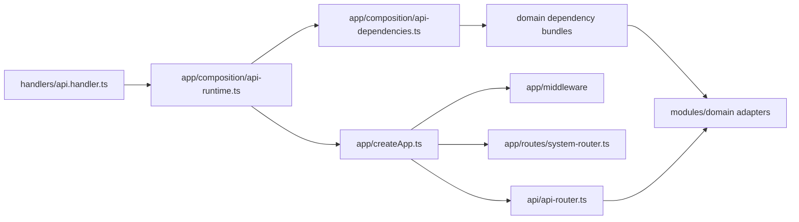

# mukuroji API server

Hono で実装した API を、Bun development server と Node.js 22 Lambda の同じ app / route 契約で実行します。コマンドは repository root から実行してください。

## Source layout

- `src/app/createApp.ts`: Hono app、共通 middleware、system route、domain route の接続だけを行う composition root
- `src/app/composition/`: domain ごとの production dependency bundle、API runtime singleton、worker composition
- `src/api/`: 互換 HTTP route 群と route 固有の application orchestration。AWS adapter の生成や runtime entrypoint は持たない
- `src/api/test-support/`: domain HTTP test 間で共有する fixture。各 test 本体は対象 module の adapter 隣へ配置
- `src/modules/<domain>/`: domain ごとの application port、use case、inbound/outbound adapter
- `src/infrastructure/`: 業務知識を持たない runtime config と AWS transport type
- `src/handlers/`: CDK と package script が参照する薄い Lambda entrypoint
- `scripts/backfills/`: HTTP route を経由しない再実行可能な backfill

`src/index.ts` は互換用の公開 re-export だけを持ちます。Bun と Lambda は
`src/handlers/` を entrypoint とし、`createApp(dependencies)` へ instance ごとの immutable な
dependency bundle を渡します。Authentication、Workspace/Enterprise、Work Item、Automation、
Developer Platform の API bundle は `src/app/composition/api-dependencies.ts` が concrete adapter
へ結び付け、worker は各 composition module が処理に必要な adapter だけを構成します。
環境変数の共通 default と production validation は
`src/infrastructure/config/server-config.ts` が所有します。各 module の外部公開面は
`src/modules/<domain>/index.ts` に集約し、module 内部では具体的な sibling file を参照します。



API Lambda、Bun server、Work Item import worker は、それぞれの composition module が生成した
immutable な production dependency set に束縛されます。Worker の起動では Hono app を生成しません。
一方、`createApp` で直接作る app はそれぞれ別の frozen dependency set と async context に束縛され、
同時に複数 instance を実行しても adapter state を共有しません。

## Local development

初回起動前に `openssl rand -hex 32` を3回実行し、それぞれ独立した64桁小文字hex出力を
git管理外の repository root `.env` に次の形式で保存します。Docker Compose はこれらを
Floci containerへ明示的に渡します。
保存後は `chmod 600 .env` でowner以外からの読み取りを禁止してください。

```dotenv
MUKUROJI_WORKSPACE_AUDIT_PSEUDONYM_KEY=<64-character-lowercase-hex-output>
ENTERPRISE_IDENTITY_TOKEN_HASH_SECRET=<different-64-character-lowercase-hex-output>
ENTERPRISE_SSO_STATE_SECRET=<third-64-character-lowercase-hex-output>
```

```sh
bun install
bun run floci:up
set -a
. .floci/generated/cognito.env
set +a
bun run server:dev
```

server は既定で `http://localhost:4566` の Floci Cognito / DynamoDB に接続します。
Ready hook は password/API 用 `mukuroji-web-local` と Hosted UI SSO 専用
`mukuroji-sso-local` を別の public client として作成します。
`floci:deploy-backend` は Lambda から Secrets Manager emulator へ接続するため、
`http://floci:4566` と `MUKUROJI_LOCAL_AWS_RUNTIME=floci` を必ず組にして渡します。
この marker は `NODE_ENV=production` では無効です。通常の AWS runtime では設定せず、
選択した region と一致する Secrets Manager standard/FIPS HTTPS endpoint を使います。
`.floci/generated/cognito.env` は Cognito endpoint、両 client ID、SSO callback などの非secret値を保持し、native Linuxの
host userからも読み込めます。Workspace access audit、enterprise credential digest、SSO state に必要な
固定 secret はこのfileへ複製せず、API writer、backfill、local backend がowner-onlyのroot `.env`から
読み込みます。

liveness check は `GET http://localhost:3000/api/health`、dependency readiness check は
`GET http://localhost:3000/api/ready` です。Readiness は Work Items、Workspace Access、Audit
Events の設定済み DynamoDB table を短い timeout 付き `DescribeTable` で実際に確認し、table
または利用可能な GSI が `ACTIVE` ではない状態、設定不足、timeout、AWS error のいずれも
`503 not-ready` として扱います。Control-plane call の集中を避けるため結果は execution
environment ごとに30秒だけ cache し、同時 check は一つにまとめます。物理 table 名や raw error は
response に含めません。

すべての `/api/*` request は client 指定の `X-Correlation-Id` と `X-Request-Id` を信頼せず、
server が canonical な値を生成します。両方を downstream request と response header へ伝播し、
CORS でも browser へ公開します。共通 access log は CloudWatch Embedded Metric Format の request
count、latency、server error count と相関 ID を構造化 JSON で記録します。Lambda では runtime
管理の invocation ID と X-Ray root trace ID も join key として記録しますが、client header、body、
query、entity ID、exception message、stack trace は保存しません。Public Request Form / requester reply と
`POST /api/auth/login` 以外の application API は、Cognito access token を
`Authorization: Bearer <token>` で受け取ります。

## Work Items integrity verifier

`work-items:integrity` は Work Items の source table または隔離済み restore table を read-only
で検査するoperator CLIです。Manifest生成ではaccount、region、物理table名、AWS profile、
専用digest key file、outputをすべて明示します。AWS profileは明示されたprofileへcredentialsを
束縛し、STS accountとtable ARN/account/regionが引数に一致しない場合はScan前に停止します。
例の`--silent`はBunによる引数echoを抑止し、CLIのstandalone JSONだけをstdout/stderrへ残します。
AWS SDK clientはenvironment/shared configのendpoint overrideを無視し、明示regionのAWS endpoint
以外へのredirectを許可しません。

```sh
bun run --silent work-items:integrity -- manifest \
  --role source \
  --account <12-digit-aws-account> \
  --region <region> \
  --table <source-work-items-table> \
  --profile <read-only-profile> \
  --digest-key-file <owner-only-64-lowercase-hex-key-file> \
  --output <source-manifest-path> \
  --source-consistency writer-fenced

bun run --silent work-items:integrity -- manifest \
  --role restore \
  --account <12-digit-aws-account> \
  --region <region> \
  --table <isolated-restore-work-items-table> \
  --profile <read-only-profile> \
  --digest-key-file <owner-only-64-lowercase-hex-key-file> \
  --output <restore-manifest-path>

bun run --silent work-items:integrity -- compare \
  --source-manifest <source-manifest-path> \
  --restore-manifest <restore-manifest-path> \
  --digest-key-file <owner-only-64-lowercase-hex-key-file>
```

Source manifestでは`--source-consistency`が必須です。`writer-fenced`は外部のwriter停止/fenceが
走査全体を覆うことをoperatorが別証拠で確認した場合だけ指定します。`live-observation`はwriterを
止めない観測用で、exact restore比較は`PASS`になりません。Restore tableはapplication trafficと
writerから隔離し、復元完了後に追加書き込みがない状態で走査します。

CLIが要求するallowlistは`sts:GetCallerIdentity`、`dynamodb:DescribeTable`、
`dynamodb:DescribeContinuousBackups`、`dynamodb:DescribeTimeToLive`、`dynamodb:Scan`だけです。
DynamoDB mutation/restore/delete権限は不要です。`Scan`は`ConsistentRead=true`でも各item単位の
strong readでありtable全体のsnapshotではないため、manifestには`snapshotIsolation=false`を
記録します。

Manifestはraw row、tenant/Workspace/Team/Work Item ID、field value、cursor、per-item digestを
出力しません。`openssl rand -hex 32`等の暗号学的に安全な乱数で作った専用keyによる
order-independentなHMAC-SHA-256 key-set/content aggregateとmanifest MACを保存し、atomic
writeされたfileはmode `0600`になります。Key fileとmanifestはrepository外の別々の
access-controlledな場所で管理してください。v1はdigest sortのため最大`1,000,000` item分を
メモリに保持し、上限超過時は不正行を含めて数え、部分manifestを作らず停止します。
既存outputは上書きせず失敗するため、drillごとに一意なevidence pathを指定してください。

このCLIはrestoreやwriter fence、定期実行、RPO/RTO測定を自動化しません。またWork Item
Configuration/Relation Graph/Audit Eventsをまたぐ不変条件、S3 restore、regional DRは検査対象外
です。Production writerを継続する既存runbookでは、exact比較用にrestore pointと対応する
外部fence証拠付きsource manifestを別途用意する必要があります。CLIの成功だけで90日 PITR
restore drillを完了扱いにしないでください。完全な手順とevidence契約は
[`docs/operational-readiness.md`](../docs/operational-readiness.md#work-items-integrity-verifier-v1)
を参照してください。

## Isolated restore drill runtime

`src/handlers/restore-drill-handler.ts`はpublic HTTP routeを持たないStep Functions task
entrypointです。Daily scheduleからの`advance`と、承認済みresourceだけを対象にする`cleanup`を
別export/roleで実行します。Durable phase、cursor、exact resource locator、operation receiptは
専用state tableに保持し、Step Functions execution dataやlogへraw row/object keyを返しません。

通常runは6表の共通PITR pointを選び、同じpointのDynamoDB exportをexact baselineとして別名table
のrestoreと比較します。稼働中sourceのScanをhistorical baselineにしません。File Proofing rowが
参照するexact source S3 VersionIdは専用scratch bucketへcopyし、range-chainによるbody一致、size、
content type、metadata、upload/deletion/malware tagを検証します。Production uploadと共通の
2 GiB上限まで、sourceとdestinationをexact `VersionId`付きの最大16 MiB `Range`で別々に読み、
各range SHA-256と
`Content-Range`/length/totalを検証してauthenticated chainをCAS更新します。Copy retry/応答消失で
生じた全new VersionIdをcleanup scopeへ記録し、決定的に選んだ1件だけを隔離済みrowへremapします。

Handlerはsource table/objectを更新・削除せず、API/workerのcompositionにもrestore resourceを公開
しません。Export file、restore Scan page、File proof page/range、cross-domain semantic claimを
invocation単位でincrementalに処理し、authenticated checkpoint、opaque HMAC claim、exact cursorだけを
専用state tableへ保存します。上限到達をpartial successにせずfailed evidence/alarmへ進め、cleanup
inventoryは検証上限で打ち切りません。Descriptor gateが比較するのはattribute definitions、base key、
GSI key/projection、billing、SSE/KMS、source TTL contractとrestore TTL disabledです。Stream、alarm、
resource tag、IAM/application binding、traffic routingはこのdata verifierの検査対象ではありません。

Semantic Scanは1 logical stepでraw rowを最大25件、requirement/Audit reducerは最大100 durable recordを
処理します。Eligibleなverification stageは1 Lambda invocationで最大50 logical stepをbatchし、8分の
elapsed-time guardでもdurable checkpointへ戻ります。これらのlogical data上限は最大値を同時処理できる
というcapacity保証ではありません。

Append-only `result.json`はevidence version、drill ID、開始/完了時刻、共通restore point、RPO/RTO、
source-export/isolated-restore aggregate digest、exact cleanup resource digest、aggregate comparison、
cross-domain/Work Items schema status、sorted failure codes、terminal outcomeを保持し、artifact全体を
`resultDigest`で認証します。Raw resource locator、cursor、個別row、HMAC keyは含めず、restricted
operational stateだけに保持します。Durable local progressは0秒、AWS収束/copy claimはbounded waitで
Standard workflowを再駆動し、task error/timeoutはdurable finalizer loopでevidence sealingを再開します。
Generic Lambda/AWS/KMS/state-store failureは非integrityの`WORKFLOW_TASK_FAILED`とし、明示的に検出した
data/descriptor/File-copy差分だけをintegrity failureに分類します。0秒redriveを含むmain-loop
`pending`はexecution全体で最大1,200回の
fuseを共有し、なお継続が必要なら専用finalizerで非integrityの
`WORKFLOW_POLL_BUDGET_EXCEEDED`をsealしてfailed evidence/alarm/remediation対象に
します。
Pass/failどちらもcleanup approvalを待ち、runnerは`result.json`、cleanup roleは`cleanup.json`だけを
書きます。Cleanup entrypointはreceiptに束縛されたrestore table、scratch object VersionId、
DynamoDB export prefixesのincomplete multipart upload以外を拒否し、1 logical step最大25件、
1 invocation最大50 zero-wait stepまたは8分まで処理します。各step前にRUNとpinned cleanup executionを
再検証し、executionが`RUNNING`かつ`redriveCount=0`でなければ拒否します。external waitが必要なら
batchを終了します。
全targetはmutable run stateと別のappend-only ledger partitionへ記録し、CopyObject inventoryを16分の
quiet windowを挟む2 passで一致確認してからsealします。Cleanup roleはledgerをread-onlyで参照し、
専用cleanup-progress partitionとrun/cadenceのcleanup-owned属性だけを更新します。

詳細は[`docs/restore-drill.md`](../docs/restore-drill.md)を参照してください。Production AWS上で
manual invoke、cleanup、deployを行う場合は、対象account/region、change record、data owner承認を
先に確認してください。

## API path contract

Hono app 内の canonical path は `/api` prefix 付きです。Lambda adapter は Function URL / API Gateway から届く prefix なしの path を canonical path へ正規化するため、次の 2 つは同じ route を呼びます。

- `<base-url>/teams/projects`
- `<base-url>/api/teams/projects`

Bun server は canonical path を直接公開するため `http://localhost:3000/api/...` を使います。Lambda では base URL に `/api` を含めても含めなくてもよく、同一 request 内で prefix を重ねて `/api/api/...` にしないでください。

主な route:

- `POST /api/auth/login`, `GET /api/auth/me`, `GET /api/auth/sso/discovery`,
  `POST /api/auth/sso/start`, `POST /api/auth/sso/exchange`
- `GET /api/dashboard/summary`
- `/api/analytics/query`, `/api/analytics/evidence`, `/api/analytics/export`
- `/api/analytics/reports`, `/api/analytics/reports/{reportId}/snapshots`
- `POST /api/teams`, `GET /api/teams/projects`
- `/api/teams/{teamId}/issues`
- `/api/teams/{teamId}/issues/{issueId}/collaboration`, `/comments`, `/watch`, `/presence`
- `/api/projects/{projectId}/issues`, `/members`, `/users`, `/watch`
- `/api/notifications`, `/api/notifications/unread-count`, `/api/notification-preferences`
- `/api/request-forms`, `/api/request-queue`, `/api/request-submissions/{submissionId}`
- `/api/request-intake/{token}`, `GET /api/request-threads/{threadToken}`, `/api/request-threads/{threadToken}/replies`
- `GET /api/enterprise/security` と `/api/enterprise/security/*` の管理 mutation
- `/api/scim/v2/{workspaceId}/ServiceProviderConfig`,
  `/api/scim/v2/{workspaceId}/Users`, `/api/scim/v2/{workspaceId}/Groups`
- `GET /api/audit/events`, `GET /api/audit/events/export`
- `/api/documents`, `/api/documents/{documentId}/operations`, `/comments`, `/presence`, `/versions`, `/shares`, `/export`
- `/api/public/documents/{token}`, `/api/document-backlinks`

The local API reads DynamoDB through `DYNAMODB_ENDPOINT`, `AWS_ENDPOINT_URL_DYNAMODB`, or `AWS_ENDPOINT_URL`.
Default local table names are:

- `MUKUROJI_DASHBOARD_TABLE=mukuroji-dashboard-local`
- `MUKUROJI_PROJECT_DIRECTORY_TABLE=mukuroji-project-directory-local`
- `MUKUROJI_COLLABORATION_TABLE=mukuroji-collaboration-local`
- `MUKUROJI_DOCUMENTS_TABLE` / `DOCUMENTS_TABLE_NAME`（未指定時は `mukuroji-documents-local`）
- `DOCUMENT_PUBLIC_SHARE_TOKEN_SECRET`（public link の冪等再送用 HMAC key。本番 CDK は 64 文字の secret を自動生成）
- `MUKUROJI_NOTIFICATIONS_TABLE=mukuroji-notifications-local`
- `NOTIFICATIONS_STATUS_INDEX_NAME=RecipientStatusIndex`
- `MUKUROJI_REALTIME_SESSIONS_TABLE=mukuroji-realtime-sessions-local`
- `MUKUROJI_AUDIT_EVENTS_TABLE=mukuroji-audit-events`
- `ENTERPRISE_IDENTITY_TABLE_NAME=mukuroji-enterprise-identity-local`（Workspace generation/`CONTROL`
  checkpoint と global domain claim を保存。Enterprise Identity 専用 GSI はありません）
- `ENTERPRISE_IDENTITY_TOKEN_HASH_SECRET=<32–256文字の安定したsecret>`（credential
  kind・Workspace・credential ID で domain-separated な digest と10分の response recovery に使用）
- `ENTERPRISE_SSO_STATE_SECRET=<別の32–256文字の安定したsecret>`
- `COGNITO_CLIENT_ID=<password/API用public client ID>`
- `COGNITO_SSO_CLIENT_ID=<Hosted UI SSO専用public client ID>`（通常 client と同じ値は拒否）
- `COGNITO_HOSTED_UI_DOMAIN`, `COGNITO_SSO_REDIRECT_URI`, `COGNITO_ENTERPRISE_IDP_NAME`
  （Cognito Hosted UI federation。Local callback の既定値は
  `http://localhost:5173/auth/sso/callback`）
- `PLANNING_TABLE_NAME=mukuroji-planning-local`
- `ANALYTICS_TABLE_NAME=mukuroji-analytics-local`
- `ANALYTICS_SCHEDULE_INDEX_NAME=ScheduleDueIndex`
- `MUKUROJI_WORKSPACE_SEARCH_TABLE` / `WORKSPACE_SEARCH_TABLE_NAME`（未指定時は `mukuroji-workspace-search-local`）
- `MUKUROJI_AUDIT_RETENTION_DAYS=2555`
- `TENANT_ADMINISTRATION_TABLE_NAME=mukuroji-tenant-administration-local`
- `MUKUROJI_WORKSPACE_AUDIT_PSEUDONYM_KEY=<64桁の小文字hex固定key>`（`openssl rand -hex 32` などで生成し、API と backfill で共有して通常は rotation しない）
- `MUKUROJI_WORKSPACE_DIRECTORY_ID=workspace#mukuroji-local`
- `MUKUROJI_WORKSPACE_ACCESS_TABLE=mukuroji-workspace-access-local`
- `REQUEST_INTAKE_TABLE_NAME=mukuroji-request-intake-local`
- `REQUEST_QUEUE_INDEX_NAME=RequestQueueIndex`
- `REQUEST_RATE_LIMIT_PER_HOUR=10`
- `MUKUROJI_REQUEST_TRUSTED_PROXY_ADDRESSES=<comma-separated proxy addresses>`（Bun server で列挙した transport source から到達した場合だけ `X-Forwarded-For` を rate-limit key に使用。未設定時は転送headerを信頼しない）
- `REQUEST_TOKEN_HASH_SECRET=<32文字以上のsecret>`（Lambda では必須）
- `REQUEST_EMAIL_WEBHOOK_SECRET=<32文字以上のsecret>`（専用 email ingestion Lambda で必須）

Project directory rows are scoped by the authenticated Cognito user's Workspace claims.
The local Floci seed writes `workspace#mukuroji-local` to both `custom:directory_id` and
`custom:workspace_id`. Canonical Work Items assigned to a Project are queried by
`workspace#mukuroji-local#project#<projectId>`.

API の access-token validator は `client_id` が `COGNITO_CLIENT_ID` または
`COGNITO_SSO_CLIENT_ID` に完全一致する token だけを受け入れます。SSO enforcement 対象では、
SSO client の token であることに加え、code exchange 時に server が access-token digest と
provider revision へ記録した authentication assurance を要求します。Token claim に同名の marker を
埋め込むだけでは SSO session になりません。

Floci は外部 SAML/OIDC federation 自体を模擬しませんが、local password auth と OAuth SSO の
境界を保つため専用 client metadata は常に作成します。`COGNITO_ENTERPRISE_IDP_NAME` がない場合の
local placeholder は `COGNITO` provider を使いますが、enterprise federation 設定が揃わないため
SSO start/exchange と enforcement は利用できません。

Planning records use `PLANNING_TABLE_NAME` and the production-compatible
`workspaceId` / `recordKey` key schema. CDK supplies the deployed `PlanningTable`
name to the API Lambda through the same environment variable.

Analytics report、immutable snapshot、scheduled delivery receipt は
`ANALYTICS_TABLE_NAME` の `workspaceId` / `recordKey` に保存します。定期配信対象は
`ANALYTICS_SCHEDULE_INDEX_NAME` の `scheduleShard` / `nextDeliveryAtRecordKey` で取得します。
API は Team partition の canonical Work Item を archived row も含めて読み、current ACL を
確定してから、同じ Team/Work Item entity ID の audit event を `EntityOccurredAtIndex` から
request 読み取り時点まで取得します。Audit reader は current schema v1 の row だけを受理し、
event の flat/nested entity type と ID が query した canonical Work Item identity に完全一致する
場合だけ採用します。旧 raw Work Item ID の query、reconciliation、authorization は行いません。
Analytics engine は `asOf` より後の project/archive/status event を巻き戻して historical state を
復元します。`asOf`時点のProjectがcurrent active/readable Project集合の外なら、現在は別の
参照可能Projectに移動済みでも集計しません。現在削除済み、またはcallerのcurrent ACL外になった
itemも集計しません。
Work Item は Team partition 100件、1 partition/合計10,000件、対象Work Itemのaudit eventは
返却合計10,000件、canonical entity timeline 500件、全timeline合計500 page query、1 entity
あたり100 pageを上限とします。canonical identity と一致しない event は採用せず、query 数と
返却event数の上限は消費します。超過時は部分結果を返さず`413`でfail-closedにします。
501件以上の Work Item は audit read 前に fail-fast します。
無関係なWorkspace historyはevent合計上限を消費しません。
Metric定義、timezone、archive、snapshot、scheduleの詳細は
[`docs/analytics.md`](../docs/analytics.md) を参照してください。

To preview and run the append-only audit backfill against local DynamoDB:

```sh
set -a
. .floci/generated/cognito.env
set +a
AWS_ENDPOINT_URL=http://localhost:4566 bun run audit:backfill -- --dry-run --limit 100
AWS_ENDPOINT_URL=http://localhost:4566 bun run audit:backfill -- \
  --source workspace-access --dry-run --limit 100
AWS_ENDPOINT_URL=http://localhost:4566 bun run audit:backfill -- \
  --checkpoint /tmp/mukuroji-audit-backfill-v3.json
```

`MUKUROJI_WORKSPACE_AUDIT_PSEUDONYM_KEY` はgenerated fileではなくowner-onlyのroot
`.env`から読み込みます。未設定または形式不正なら、backfillは開始前にfail-closedで停止します。

The write run bootstraps `mukuroji-audit-events` with the production-compatible
keys, GSIs, and stream when the local table does not exist. Dry runs do not
create the table or write events/checkpoints. The `workspace-access` source maps
`workspace-member` and `workspace-invitation` rows to suppressed snapshot events;
the Workspace metadata row is counted as ignored, while unknown or malformed
lifecycle rows stop the run. Workspace timestamps must use canonical UTC ISO
format. Dry-run logs omit entity and target IDs.

AWS runs require `WORKSPACE_ACCESS_TABLE_NAME` in addition to the existing source
table variables and `AUDIT_EVENTS_TABLE_NAME`. Audit backfill checkpoint v3 contains
the three current sources and is not compatible with v1/v2 checkpoints. Use a new
checkpoint path; rescanning sources is safe because event writes are deterministic
and conditional. The default v3 checkpoint is
`./audit-event-backfill-v3.checkpoint.json`; it is created with owner-only
permissions because its `LastEvaluatedKey` can contain source identifiers. Delete
it after the migration is complete. Checkpoints created with a different table,
key, or current-schema configuration are rejected by the configuration hash.
Unknown-timestamp snapshot events omit TTL so they are not immediately deleted.

## Team Issue comment backfill

Team Issue `commented` events are copied to the canonical Collaboration table
with their stable event IDs. The resumable runner writes a checkpoint after
each DynamoDB scan page and publishes one completion marker per observed
workspace only after the source scan reaches its end. An unfiltered run also
publishes an environment-wide marker for workspaces with no legacy comments.
Until an applicable marker exists, the API keeps a bounded, read-only legacy
comment fallback; after the marker it serves canonical comments only.

Preview and run the migration locally with:

```sh
AWS_ENDPOINT_URL=http://localhost:4566 \
MUKUROJI_LOCAL_AWS_RUNTIME=floci \
bun run team-issue-comments:backfill -- --dry-run --limit 100
AWS_ENDPOINT_URL=http://localhost:4566 \
MUKUROJI_LOCAL_AWS_RUNTIME=floci \
bun run team-issue-comments:backfill -- \
  --checkpoint /tmp/mukuroji-team-issue-comments-v2.json
```

AWS runs require `TEAM_ISSUE_EVENTS_TABLE_NAME`, `COLLABORATION_TABLE_NAME`,
`WORK_ITEMS_TABLE_NAME`, `AUDIT_EVENTS_TABLE_NAME`, and
`WORKSPACE_SEARCH_TABLE_NAME`. The write run projects each current canonical
comment into Workspace Search and records projected/deleted document counts in
the checkpoint and completion audit. The checkpoint is owner-only because its continuation key can contain source identifiers. Reusing
a checkpoint against different tables, region, account, or workspace filters is
rejected. The write run is idempotent; malformed scope or conflicting canonical
rows stop the migration without publishing a completion marker. If a legacy
comment's parent Work Item is strongly confirmed to be deleted, the runner
writes a scoped reconciliation receipt containing the source fingerprint and
continues without creating an orphaned canonical comment. The runner obtains
the account from STS `GetCallerIdentity`; an optional
`AWS_ACCOUNT_ID` is treated only as an expected value and must match the
authenticated account. An optional `MUKUROJI_BACKFILL_OPERATOR_ID` is retained as
an operator label, while AWS audit records use the authenticated STS caller ARN;
local runs use the `local:backfill` sentinel. Canonical repairs and marker
publication use the deployment's configured DynamoDB document client.
Use repeated `--workspace-id <id>` options to scan and mark a selected set of
workspaces before processing the rest of the environment. An unfiltered run
marks the environment-wide scope after the complete source scan, including
workspaces with no matching legacy comments.

## Workspace search canonical projection bootstrap

Workspace search は `WorkspaceSearchTable` の `workspaceId` / `recordKey` に、検索文書、
saved view、ユーザーごとの view preference を保存します。初期データは migration planner を介さず、
current Team、Project、canonical Work Item、comment、Document から canonical projection を直接作成します。
まず dry-run で mapping と skip 件数を確認します。

```sh
AWS_ENDPOINT_URL=http://localhost:4566 bun run search:backfill -- --dry-run
AWS_ENDPOINT_URL=http://localhost:4566 bun run search:backfill
```

一つの source だけを調査する場合は `--source project-directory`、
`--source work-items`、`--source collaboration`、`--source documents` を指定できます。
Floci の既定 seed は `project-directory` と `work-items` をそれぞれ `--limit 100` で実行すれば
有限 run で初期 projection を作成できます。`--limit` は dry-run や小さな検証 run の scan 件数も
制限します。

AWS 環境では次の table 名を明示します。

```sh
export PROJECT_DIRECTORY_TABLE_NAME=<ProjectDirectoryTableName>
export WORK_ITEMS_TABLE_NAME=<WorkItemsTableName>
export COLLABORATION_TABLE_NAME=<WorkItemCollaborationTableName>
export DOCUMENTS_TABLE_NAME=<DocumentsTableName>
export WORKSPACE_SEARCH_TABLE_NAME=<WorkspaceSearchTableName>

bun run search:backfill -- --dry-run
bun run search:backfill
```

各検索文書の key は entity type と canonical entity ID から決定され、put/delete は同じ key に
適用されます。そのため、失敗後や source 更新後も同じコマンドを安全に再実行できます。
Soft delete 済み comment と archived Team/Project は、再実行時に対応する検索文書を削除します。
同じ `issueId` が複数 Team に存在しても、Work Item と comment の entity ID は Team scope を
含むため混在しません。

この bootstrap/backfill は source/target scan evidence、planning artifact、sealed authority を
生成または参照しません。初期作成後は current application event の通常経路が同じ canonical key を
更新します。

`search:backfill` は production migration / cutover の代替ではありません。lease、durable
checkpoint、lossless preimage journal、独立した verify、rollback を持たないため、新しい schema や
data migration には使用しません。

既存 canonical projection の repair として本番実行する場合に限り、事前に PITR と
forward-repair plan を承認し、dry-run の件数を保存したうえで maintenance window 全体を通して
source writer を停止します。途中で失敗した場合は writer を停止したまま選択した source の先頭から
再実行し、完走後に source/target 件数と read smoke を確認してから writer を再開します。Source の
更新と projection が競合すると、古い scan 結果を一時的に再投影し得ます。

現時点では file の保存元は未導入のため、file は backfill 対象になりません。
Work Item は canonical row の `creatorMemberKey`、`workflowStatusId`、`customFieldValues`、
`relationIds` を検索文書の `creatorUserId`、`status`、`customFields`、`relationIds` へ投影します。
旧 `customFields` や必須 canonical field を欠く row は変換せず、invalid source として扱います。

Document は mutation のたびに current snapshot を検索文書へ live projection します。
Detail polling は検索 table へ書き込みません。既存 Document の再同期や一時障害後の
reconciliation は
`bun run search:backfill -- --source documents` で実行できます。Archived Document は対応する
検索文書を削除し、malformed row や version/receipt row は fail-closed で skip します。

Runtime API は `GET /api/search?filters=<JSON>&cursor=<opaque>&limit=<count>` と、
`GET|POST /api/saved-views`、`PATCH|DELETE /api/saved-views/{viewId}` を提供します。
DELETE は `expectedRevision` query parameter を必須とし、saved view definition の更新・削除は
revision が競合した場合に `SavedViewRevisionConflict` を返します。
