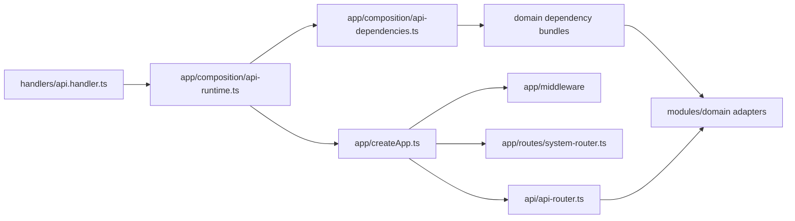

# mukuroji API server

Hono で実装した API を、Bun development server と Node.js 22 Lambda の同じ app / route 契約で実行します。コマンドは repository root から実行してください。

## Source layout

- `src/app/createApp.ts`: Hono app、共通 middleware、system route、domain route の接続だけを行う composition root
- `src/app/composition/`: domain ごとの production dependency bundle、API runtime singleton、worker composition
- `src/api/`: 互換 HTTP route 群と route 固有の application orchestration。AWS adapter の生成や runtime entrypoint は持たない
- `src/api/test-support/`: domain HTTP test 間で共有する fixture。各 test 本体は対象 module の adapter 隣へ配置
- `src/modules/<domain>/`: domain ごとの application port、use case、inbound/outbound adapter
- `src/infrastructure/`: 業務知識を持たない runtime config と AWS transport type
- `src/handlers/`: CDK と package script が参照する薄い Lambda entrypoint
- `scripts/backfills/`: HTTP route を経由しない再実行可能な backfill

`src/index.ts` は互換用の公開 re-export だけを持ちます。Bun と Lambda は
`src/handlers/` を entrypoint とし、`createApp(dependencies)` へ instance ごとの immutable な
dependency bundle を渡します。Authentication、Workspace/Enterprise、Work Item、Automation、
Developer Platform の API bundle は `src/app/composition/api-dependencies.ts` が concrete adapter
へ結び付け、worker は各 composition module が処理に必要な adapter だけを構成します。
環境変数の共通 default と production validation は
`src/infrastructure/config/server-config.ts` が所有します。各 module の外部公開面は
`src/modules/<domain>/index.ts` に集約し、module 内部では具体的な sibling file を参照します。



API Lambda、Bun server、Work Item import worker は、それぞれの composition module が生成した
immutable な production dependency set に束縛されます。Worker の起動では Hono app を生成しません。
一方、`createApp` で直接作る app はそれぞれ別の frozen dependency set と async context に束縛され、
同時に複数 instance を実行しても adapter state を共有しません。

## Local development

初回起動前に `openssl rand -hex 32` を3回実行し、それぞれ独立した64桁小文字hex出力を
git管理外の repository root `.env` に次の形式で保存します。Docker Compose はこれらを
Floci containerへ明示的に渡します。
保存後は `chmod 600 .env` でowner以外からの読み取りを禁止してください。

```dotenv
MUKUROJI_WORKSPACE_AUDIT_PSEUDONYM_KEY=<64-character-lowercase-hex-output>
ENTERPRISE_IDENTITY_TOKEN_HASH_SECRET=<different-64-character-lowercase-hex-output>
ENTERPRISE_SSO_STATE_SECRET=<third-64-character-lowercase-hex-output>
```

```sh
bun install
bun run floci:up
set -a
. .floci/generated/cognito.env
set +a
bun run server:dev
```

server は既定で `http://localhost:4566` の Floci Cognito / DynamoDB に接続します。
Ready hook は password/API 用 `mukuroji-web-local` と Hosted UI SSO 専用
`mukuroji-sso-local` を別の public client として作成します。
`floci:deploy-backend` は Lambda から Secrets Manager emulator へ接続するため、
`http://floci:4566` と `MUKUROJI_LOCAL_AWS_RUNTIME=floci` を必ず組にして渡します。
この marker は `NODE_ENV=production` では無効です。通常の AWS runtime では設定せず、
選択した region と一致する Secrets Manager standard/FIPS HTTPS endpoint を使います。
`.floci/generated/cognito.env` は Cognito endpoint、両 client ID、SSO callback などの非secret値を保持し、native Linuxの
host userからも読み込めます。Workspace access audit、enterprise credential digest、SSO state に必要な
固定 secret はこのfileへ複製せず、API writer、backfill、local backend がowner-onlyのroot `.env`から
読み込みます。

liveness check は `GET http://localhost:3000/api/health`、dependency readiness check は
`GET http://localhost:3000/api/ready` です。Readiness は Work Items、Workspace Access、Audit
Events の設定済み DynamoDB table を短い timeout 付き `DescribeTable` で実際に確認し、table
または利用可能な GSI が `ACTIVE` ではない状態、設定不足、timeout、AWS error のいずれも
`503 not-ready` として扱います。Control-plane call の集中を避けるため結果は execution
environment ごとに30秒だけ cache し、同時 check は一つにまとめます。物理 table 名や raw error は
response に含めません。

すべての `/api/*` request は client 指定の `X-Correlation-Id` と `X-Request-Id` を信頼せず、
server が canonical な値を生成します。両方を downstream request と response header へ伝播し、
CORS でも browser へ公開します。共通 access log は CloudWatch Embedded Metric Format の request
count、latency、server error count と相関 ID を構造化 JSON で記録します。Lambda では runtime
管理の invocation ID と X-Ray root trace ID も join key として記録しますが、client header、body、
query、entity ID、exception message、stack trace は保存しません。Public Request Form / requester reply と
`POST /api/auth/login` 以外の application API は、Cognito access token を
`Authorization: Bearer <token>` で受け取ります。

## Work Items integrity verifier

`work-items:integrity` は Work Items の source table または隔離済み restore table を read-only
で検査するoperator CLIです。Manifest生成ではaccount、region、物理table名、AWS profile、
専用digest key file、outputをすべて明示します。AWS profileは明示されたprofileへcredentialsを
束縛し、STS accountとtable ARN/account/regionが引数に一致しない場合はScan前に停止します。
例の`--silent`はBunによる引数echoを抑止し、CLIのstandalone JSONだけをstdout/stderrへ残します。
AWS SDK clientはenvironment/shared configのendpoint overrideを無視し、明示regionのAWS endpoint
以外へのredirectを許可しません。

```sh
bun run --silent work-items:integrity -- manifest \
  --role source \
  --account <12-digit-aws-account> \
  --region <region> \
  --table <source-work-items-table> \
  --profile <read-only-profile> \
  --digest-key-file <owner-only-64-lowercase-hex-key-file> \
  --output <source-manifest-path> \
  --source-consistency writer-fenced

bun run --silent work-items:integrity -- manifest \
  --role restore \
  --account <12-digit-aws-account> \
  --region <region> \
  --table <isolated-restore-work-items-table> \
  --profile <read-only-profile> \
  --digest-key-file <owner-only-64-lowercase-hex-key-file> \
  --output <restore-manifest-path>

bun run --silent work-items:integrity -- compare \
  --source-manifest <source-manifest-path> \
  --restore-manifest <restore-manifest-path> \
  --digest-key-file <owner-only-64-lowercase-hex-key-file>
```

Source manifestでは`--source-consistency`が必須です。`writer-fenced`は外部のwriter停止/fenceが
走査全体を覆うことをoperatorが別証拠で確認した場合だけ指定します。`live-observation`はwriterを
止めない観測用で、exact restore比較は`PASS`になりません。Restore tableはapplication trafficと
writerから隔離し、復元完了後に追加書き込みがない状態で走査します。

CLIが要求するallowlistは`sts:GetCallerIdentity`、`dynamodb:DescribeTable`、
`dynamodb:DescribeContinuousBackups`、`dynamodb:DescribeTimeToLive`、`dynamodb:Scan`だけです。
DynamoDB mutation/restore/delete権限は不要です。`Scan`は`ConsistentRead=true`でも各item単位の
strong readでありtable全体のsnapshotではないため、manifestには`snapshotIsolation=false`を
記録します。

Manifestはraw row、tenant/Workspace/Team/Work Item ID、field value、cursor、per-item digestを
出力しません。`openssl rand -hex 32`等の暗号学的に安全な乱数で作った専用keyによる
order-independentなHMAC-SHA-256 key-set/content aggregateとmanifest MACを保存し、atomic
writeされたfileはmode `0600`になります。Key fileとmanifestはrepository外の別々の
access-controlledな場所で管理してください。v1はdigest sortのため最大`1,000,000` item分を
メモリに保持し、上限超過時は不正行を含めて数え、部分manifestを作らず停止します。
既存outputは上書きせず失敗するため、drillごとに一意なevidence pathを指定してください。

このCLIはrestoreやwriter fence、定期実行、RPO/RTO測定を自動化しません。またWork Item
Configuration/Relation Graph/Audit Eventsをまたぐ不変条件、S3 restore、regional DRは検査対象外
です。Production writerを継続する既存runbookでは、exact比較用にrestore pointと対応する
外部fence証拠付きsource manifestを別途用意する必要があります。CLIの成功だけで90日 PITR
restore drillを完了扱いにしないでください。完全な手順とevidence契約は
[`docs/operational-readiness.md`](../docs/operational-readiness.md#work-items-integrity-verifier-v1)
を参照してください。

## Isolated restore drill runtime

`src/handlers/restore-drill-handler.ts`はpublic HTTP routeを持たないStep Functions task
entrypointです。Daily scheduleからの`advance`と、承認済みresourceだけを対象にする`cleanup`を
別export/roleで実行します。Durable phase、cursor、exact resource locator、operation receiptは
専用state tableに保持し、Step Functions execution dataやlogへraw row/object keyを返しません。

通常runは6表の共通PITR pointを選び、同じpointのDynamoDB exportをexact baselineとして別名table
のrestoreと比較します。稼働中sourceのScanをhistorical baselineにしません。File Proofing rowが
参照するexact source S3 VersionIdは専用scratch bucketへcopyし、range-chainによるbody一致、size、
content type、metadata、upload/deletion/malware tagを検証します。Production uploadと共通の
2 GiB上限まで、sourceとdestinationをexact `VersionId`付きの最大16 MiB `Range`で別々に読み、
各range SHA-256と
`Content-Range`/length/totalを検証してauthenticated chainをCAS更新します。Copy retry/応答消失で
生じた全new VersionIdをcleanup scopeへ記録し、決定的に選んだ1件だけを隔離済みrowへremapします。

Handlerはsource table/objectを更新・削除せず、API/workerのcompositionにもrestore resourceを公開
しません。Export file、restore Scan page、File proof page/range、cross-domain semantic claimを
invocation単位でincrementalに処理し、authenticated checkpoint、opaque HMAC claim、exact cursorだけを
専用state tableへ保存します。上限到達をpartial successにせずfailed evidence/alarmへ進め、cleanup
inventoryは検証上限で打ち切りません。Descriptor gateが比較するのはattribute definitions、base key、
GSI key/projection、billing、SSE/KMS、source TTL contractとrestore TTL disabledです。Stream、alarm、
resource tag、IAM/application binding、traffic routingはこのdata verifierの検査対象ではありません。

Semantic Scanは1 logical stepでraw rowを最大25件、requirement/Audit reducerは最大100 durable recordを
処理します。Eligibleなverification stageは1 Lambda invocationで最大50 logical stepをbatchし、8分の
elapsed-time guardでもdurable checkpointへ戻ります。これらのlogical data上限は最大値を同時処理できる
というcapacity保証ではありません。

Append-only `result.json`はevidence version、drill ID、開始/完了時刻、共通restore point、RPO/RTO、
source-export/isolated-restore aggregate digest、exact cleanup resource digest、aggregate comparison、
cross-domain/Work Items schema status、sorted failure codes、terminal outcomeを保持し、artifact全体を
`resultDigest`で認証します。Raw resource locator、cursor、個別row、HMAC keyは含めず、restricted
operational stateだけに保持します。Durable local progressは0秒、AWS収束/copy claimはbounded waitで
Standard workflowを再駆動し、task error/timeoutはdurable finalizer loopでevidence sealingを再開します。
Generic Lambda/AWS/KMS/state-store failureは非integrityの`WORKFLOW_TASK_FAILED`とし、明示的に検出した
data/descriptor/File-copy差分だけをintegrity failureに分類します。0秒redriveを含むmain-loop
`pending`はexecution全体で最大1,200回の
fuseを共有し、なお継続が必要なら専用finalizerで非integrityの
`WORKFLOW_POLL_BUDGET_EXCEEDED`をsealしてfailed evidence/alarm/remediation対象に
します。
Pass/failどちらもcleanup approvalを待ち、runnerは`result.json`、cleanup roleは`cleanup.json`だけを
書きます。Cleanup entrypointはreceiptに束縛されたrestore table、scratch object VersionId、
DynamoDB export prefixesのincomplete multipart upload以外を拒否し、1 logical step最大25件、
1 invocation最大50 zero-wait stepまたは8分まで処理します。各step前にRUNとpinned cleanup executionを
再検証し、executionが`RUNNING`かつ`redriveCount=0`でなければ拒否します。external waitが必要なら
batchを終了します。
全targetはmutable run stateと別のappend-only ledger partitionへ記録し、CopyObject inventoryを16分の
quiet windowを挟む2 passで一致確認してからsealします。Cleanup roleはledgerをread-onlyで参照し、
専用cleanup-progress partitionとrun/cadenceのcleanup-owned属性だけを更新します。

詳細は[`docs/restore-drill.md`](../docs/restore-drill.md)を参照してください。Production AWS上で
manual invoke、cleanup、deployを行う場合は、対象account/region、change record、data owner承認を
先に確認してください。

## API path contract

Hono app 内の canonical path は `/api` prefix 付きです。Lambda adapter は Function URL / API Gateway から届く prefix なしの path を canonical path へ正規化するため、次の 2 つは同じ route を呼びます。

- `<base-url>/teams/projects`
- `<base-url>/api/teams/projects`

Bun server は canonical path を直接公開するため `http://localhost:3000/api/...` を使います。Lambda では base URL に `/api` を含めても含めなくてもよく、同一 request 内で prefix を重ねて `/api/api/...` にしないでください。

主な route:

- `POST /api/auth/login`, `GET /api/auth/me`, `GET /api/auth/sso/discovery`,
  `POST /api/auth/sso/start`, `POST /api/auth/sso/exchange`
- `GET /api/dashboard/summary`
- `/api/analytics/query`, `/api/analytics/evidence`, `/api/analytics/export`
- `/api/analytics/reports`, `/api/analytics/reports/{reportId}/snapshots`
- `POST /api/teams`, `GET /api/teams/projects`
- `/api/teams/{teamId}/issues`
- `/api/teams/{teamId}/issues/{issueId}/collaboration`, `/comments`, `/watch`, `/presence`
- `/api/projects/{projectId}/tasks`, `/issues`, `/members`, `/users`, `/watch`
- `/api/notifications`, `/api/notifications/unread-count`, `/api/notification-preferences`
- `/api/request-forms`, `/api/request-queue`, `/api/request-submissions/{submissionId}`
- `/api/request-intake/{token}`, `GET /api/request-threads/{threadToken}`, `/api/request-threads/{threadToken}/replies`
- `GET /api/enterprise/security` と `/api/enterprise/security/*` の管理 mutation
- `/api/scim/v2/{workspaceId}/ServiceProviderConfig`,
  `/api/scim/v2/{workspaceId}/Users`, `/api/scim/v2/{workspaceId}/Groups`
- `GET /api/audit/events`, `GET /api/audit/events/export`
- `/api/documents`, `/api/documents/{documentId}/operations`, `/comments`, `/presence`, `/versions`, `/shares`, `/export`
- `/api/public/documents/{token}`, `/api/document-backlinks`

The local API reads DynamoDB through `DYNAMODB_ENDPOINT`, `AWS_ENDPOINT_URL_DYNAMODB`, or `AWS_ENDPOINT_URL`.
Default local table names are:

- `MUKUROJI_DASHBOARD_TABLE=mukuroji-dashboard-local`
- `MUKUROJI_PROJECT_TASKS_TABLE=mukuroji-project-tasks-v2-local`
- `MUKUROJI_PROJECT_DIRECTORY_TABLE=mukuroji-project-directory-local`
- `MUKUROJI_COLLABORATION_TABLE=mukuroji-collaboration-local`
- `MUKUROJI_DOCUMENTS_TABLE` / `DOCUMENTS_TABLE_NAME`（未指定時は `mukuroji-documents-local`）
- `DOCUMENT_PUBLIC_SHARE_TOKEN_SECRET`（public link の冪等再送用 HMAC key。本番 CDK は 64 文字の secret を自動生成）
- `MUKUROJI_NOTIFICATIONS_TABLE=mukuroji-notifications-local`
- `NOTIFICATIONS_STATUS_INDEX_NAME=RecipientStatusIndex`
- `MUKUROJI_REALTIME_SESSIONS_TABLE=mukuroji-realtime-sessions-local`
- `MUKUROJI_AUDIT_EVENTS_TABLE=mukuroji-audit-events`
- `ENTERPRISE_IDENTITY_TABLE_NAME=mukuroji-enterprise-identity-local`（Workspace generation/`CONTROL`
  checkpoint と global domain claim を保存。Enterprise Identity 専用 GSI はありません）
- `ENTERPRISE_IDENTITY_TOKEN_HASH_SECRET=<32–256文字の安定したsecret>`（credential
  kind・Workspace・credential ID で domain-separated な digest と10分の response recovery に使用）
- `ENTERPRISE_SSO_STATE_SECRET=<別の32–256文字の安定したsecret>`
- `COGNITO_CLIENT_ID=<password/API用public client ID>`
- `COGNITO_SSO_CLIENT_ID=<Hosted UI SSO専用public client ID>`（通常 client と同じ値は拒否）
- `COGNITO_HOSTED_UI_DOMAIN`, `COGNITO_SSO_REDIRECT_URI`, `COGNITO_ENTERPRISE_IDP_NAME`
  （Cognito Hosted UI federation。Local callback の既定値は
  `http://localhost:5173/auth/sso/callback`）
- `PLANNING_TABLE_NAME=mukuroji-planning-local`
- `ANALYTICS_TABLE_NAME=mukuroji-analytics-local`
- `ANALYTICS_SCHEDULE_INDEX_NAME=ScheduleDueIndex`
- `MUKUROJI_WORKSPACE_SEARCH_TABLE` / `WORKSPACE_SEARCH_TABLE_NAME`（未指定時は `mukuroji-workspace-search-local`）
- `MUKUROJI_AUDIT_RETENTION_DAYS=2555`
- `TENANT_ADMINISTRATION_TABLE_NAME=mukuroji-tenant-administration-local`
- `MUKUROJI_WORKSPACE_AUDIT_PSEUDONYM_KEY=<64桁の小文字hex固定key>`（`openssl rand -hex 32` などで生成し、API と backfill で共有して通常は rotation しない）
- `MUKUROJI_WORKSPACE_DIRECTORY_ID=workspace#mukuroji-local`
- `MUKUROJI_WORKSPACE_ACCESS_TABLE=mukuroji-workspace-access-local`
- `REQUEST_INTAKE_TABLE_NAME=mukuroji-request-intake-local`
- `REQUEST_QUEUE_INDEX_NAME=RequestQueueIndex`
- `REQUEST_RATE_LIMIT_PER_HOUR=10`
- `MUKUROJI_REQUEST_TRUSTED_PROXY_ADDRESSES=<comma-separated proxy addresses>`（Bun server で列挙した transport source から到達した場合だけ `X-Forwarded-For` を rate-limit key に使用。未設定時は転送headerを信頼しない）
- `REQUEST_TOKEN_HASH_SECRET=<32文字以上のsecret>`（Lambda では必須）
- `REQUEST_EMAIL_WEBHOOK_SECRET=<32文字以上のsecret>`（専用 email ingestion Lambda で必須）

Project directory rows are scoped by the authenticated Cognito user's Workspace claims.
The local Floci seed writes `workspace#mukuroji-local` to both `custom:directory_id` and
`custom:workspace_id`. Project task rows are queried by
`workspace#mukuroji-local#project#<projectId>`.

API の access-token validator は `client_id` が `COGNITO_CLIENT_ID` または
`COGNITO_SSO_CLIENT_ID` に完全一致する token だけを受け入れます。SSO enforcement 対象では、
SSO client の token であることに加え、code exchange 時に server が access-token digest と
provider revision へ記録した authentication assurance を要求します。Token claim に同名の marker を
埋め込むだけでは SSO session になりません。

Floci は外部 SAML/OIDC federation 自体を模擬しませんが、local password auth と OAuth SSO の
境界を保つため専用 client metadata は常に作成します。`COGNITO_ENTERPRISE_IDP_NAME` がない場合の
local placeholder は `COGNITO` provider を使いますが、enterprise federation 設定が揃わないため
SSO start/exchange と enforcement は利用できません。

Planning records use `PLANNING_TABLE_NAME` and the production-compatible
`workspaceId` / `recordKey` key schema. CDK supplies the deployed `PlanningTable`
name to the API Lambda through the same environment variable.

Analytics report、immutable snapshot、scheduled delivery receipt は
`ANALYTICS_TABLE_NAME` の `workspaceId` / `recordKey` に保存します。定期配信対象は
`ANALYTICS_SCHEDULE_INDEX_NAME` の `scheduleShard` / `nextDeliveryAtRecordKey` で取得します。
API は Team partition の canonical Work Item を archived row も含めて読み、current ACL を
確定してから、同じ Team/Work Item entity ID の audit event を `EntityOccurredAtIndex` から
request 読み取り時点まで取得します。Legacy raw ID は metadata またはcanonical targetで
current authorized Work Itemへ一意に解決し、存在するidentity sourceがすべて一致するeventだけを
採用します。
Analytics engine は `asOf` より後の project/archive/status event を巻き戻して historical state を
復元します。`asOf`時点のProjectがcurrent active/readable Project集合の外なら、現在は別の
参照可能Projectに移動済みでも集計しません。現在削除済み、またはcallerのcurrent ACL外になった
itemも集計しません。
Work Item は Team partition 100件、1 partition/合計10,000件、対象Work Itemのaudit eventは
返却合計10,000件、canonical/legacy rawを合わせたidentity timeline 500件、全timeline合計
500 page query、1 identityあたり100 pageを上限とします。raw ID eventが認可・identity
整合性チェックで除外される場合もpage queryと返却eventの上限を消費します。超過時は部分結果を
返さず`413`でfail-closedにします。raw IDが重複しない通常構成では1 Work Itemあたり2 timelineを
確認するため、250件を超える場合はaudit read前にfail-fastします。
無関係なWorkspace historyはevent合計上限を消費しません。
Metric定義、timezone、archive、snapshot、scheduleの詳細は
[`docs/analytics.md`](../docs/analytics.md) を参照してください。

To preview and run the append-only audit backfill against local DynamoDB:

```sh
set -a
. .floci/generated/cognito.env
set +a
AWS_ENDPOINT_URL=http://localhost:4566 bun run audit:backfill -- --dry-run --limit 100
AWS_ENDPOINT_URL=http://localhost:4566 bun run audit:backfill -- \
  --source workspace-access --dry-run --limit 100
AWS_ENDPOINT_URL=http://localhost:4566 bun run audit:backfill -- \
  --checkpoint /tmp/mukuroji-audit-backfill-v2.json
```

`MUKUROJI_WORKSPACE_AUDIT_PSEUDONYM_KEY` はgenerated fileではなくowner-onlyのroot
`.env`から読み込みます。未設定または形式不正なら、backfillは開始前にfail-closedで停止します。

The write run bootstraps `mukuroji-audit-events` with the production-compatible
keys, GSIs, and stream when the local table does not exist. Dry runs do not
create the table or write events/checkpoints. The `workspace-access` source maps
`workspace-member` and `workspace-invitation` rows to suppressed snapshot events;
the Workspace metadata row is counted as ignored, while unknown or malformed
lifecycle rows stop the run. Workspace timestamps must use canonical UTC ISO
format. Dry-run logs omit entity and target IDs.

AWS runs require `WORKSPACE_ACCESS_TABLE_NAME` in addition to the existing source
table variables and `AUDIT_EVENTS_TABLE_NAME`. Audit backfill checkpoint v2 adds
the Workspace access source and is not compatible with a v1 checkpoint. Use a new
checkpoint path; rescanning older sources is safe because event writes are
deterministic and conditional. The default v2 checkpoint is
`./audit-event-backfill-v2.checkpoint.json`; it is created with owner-only
permissions because its `LastEvaluatedKey` can contain source identifiers. Delete
it after the migration is complete. Checkpoints created with the pre-hex-decoding
Workspace access ID contract are rejected by the configuration hash. Unknown-timestamp snapshot events omit TTL so
they are not immediately deleted.

## Team Issue comment backfill

Team Issue `commented` events are copied to the canonical Collaboration table
with their stable event IDs. The resumable runner writes a checkpoint after
each DynamoDB scan page and publishes one completion marker per observed
workspace only after the source scan reaches its end. Until that marker exists,
the API keeps a bounded, read-only legacy comment fallback; after the marker it
serves canonical comments only.

Preview and run the migration locally with:

```sh
AWS_ENDPOINT_URL=http://localhost:4566 \
MUKUROJI_LOCAL_AWS_RUNTIME=floci \
bun run team-issue-comments:backfill -- --dry-run --limit 100
AWS_ENDPOINT_URL=http://localhost:4566 \
MUKUROJI_LOCAL_AWS_RUNTIME=floci \
bun run team-issue-comments:backfill -- \
  --checkpoint /tmp/mukuroji-team-issue-comments-v1.json
```

AWS runs require `MUKUROJI_BACKFILL_OPERATOR_ID`,
`TEAM_ISSUE_EVENTS_TABLE_NAME`, `COLLABORATION_TABLE_NAME`,
`TEAM_ISSUES_TABLE_NAME`, and `AUDIT_EVENTS_TABLE_NAME`. The checkpoint is
owner-only because its continuation key can contain source identifiers. Reusing
a checkpoint against different tables, region, account, or workspace filters is
rejected. The write run is idempotent; malformed scope, missing Work Items, or
conflicting canonical rows stop the migration without publishing a completion
marker. The runner obtains the account from STS `GetCallerIdentity`; an optional
`AWS_ACCOUNT_ID` is treated only as an expected value and must match the
authenticated account. Canonical repairs and marker publication run inside the
workspace-search writer-fence invocation.
Use repeated `--workspace-id <id>` options to scan and mark a selected set of
workspaces before processing the rest of the environment.

## Workspace search backfill

Workspace search は `WorkspaceSearchTable` の `workspaceId` / `recordKey` に、検索文書、
saved view、ユーザーごとの view preference を保存します。既存データを検索文書へ投影する前に、
まず dry-run で Team、Project、canonical Work Item、comment の mapping と skip 件数を確認します。

```sh
AWS_ENDPOINT_URL=http://localhost:4566 bun run search:backfill -- --dry-run
AWS_ENDPOINT_URL=http://localhost:4566 bun run search:backfill
```

一つの source だけを調査する場合は `--source project-directory`、
`--source work-items`、`--source collaboration` を指定できます。`--limit 100` は
dry-run や小さな検証 run で scan 件数を制限します。

AWS 環境では次の table 名を明示します。

```sh
export PROJECT_DIRECTORY_TABLE_NAME=<ProjectDirectoryTableName>
export WORK_ITEMS_TABLE_NAME=<WorkItemsTableName>
export COLLABORATION_TABLE_NAME=<WorkItemCollaborationTableName>
export DOCUMENTS_TABLE_NAME=<DocumentsTableName>
export WORKSPACE_SEARCH_TABLE_NAME=<WorkspaceSearchTableName>

bun run search:backfill -- --dry-run
bun run search:backfill
```

各検索文書の key は entity type と canonical entity ID から決定され、put/delete は同じ key に
適用されます。そのため、失敗後や source 更新後も同じコマンドを安全に再実行できます。
Soft delete 済み comment と archived Team/Project は、再実行時に対応する検索文書を削除します。
同じ `issueId` が複数 Team に存在しても、Work Item と comment の entity ID は Team scope を
含むため混在しません。

Backfill は checkpoint を保存せず、再実行時は選択した source の先頭から読み直します。
Source の更新と projection が競合すると古い scan 結果を一時的に再投影し得るため、本番では
書き込みを止めた maintenance window で実行し、API の live projection を有効化した後に
もう一度 backfill を完走してから書き込みを再開してください。

このlegacy backfillは、production-safe migrationのlease、lossless journal、checkpoint、rollback、
writer-fence lifecycleを代替しません。Workspace Search migration v1のresource measurement、
writer-fence status、初回guarded rolloutのopen-row bootstrapには、explicit named profileとCDK outputを
受け取るcontrol CLIを使用します。完全なflagと安全境界は
`bun run --silent search:migration:control -- help`および
[`docs/operational-readiness.md`](../docs/operational-readiness.md)の
「Migration control CLI foundation」を参照してください。このCLIは明示的なapproval、review済み
configuration hash、run/owner、fresh maintenance evidence、durable `DescribeTable` rate policyを要求し、
writer-fence close/replan、apply、verify、2種類のrollback、terminal releaseを互いに自動連鎖しない
commandとして提供します。Control result/errorと同じ1行には`Mukuroji/WorkspaceSearchMigration`の
Service-only terminal EMFを含め、operation/phase/outcome、configuration binding/hash、policy version、
process生成のcorrelation/evidence locator、checkpoint progress、DescribeTable
attempt/throttle/wait/budget stop/exhaustion、quarantine、terminal failureをsecret-freeに集約します。
5分のlive checkpoint stallだけはhung中にもalarmを発火できる独立EMF行を即時出力し、terminal recordと
metricを二重計上しません。初回`measure`がidentity確定前に失敗した場合は`unbound`を明示してhashを
省略します。Non-`measure`の`bound`はreview済みexpected hashへのcorrelation bindingであり、fresh
measurement成功やruntime configuration一致の証明ではありません。Run/owner ID、resource名/ARN、
account/profile、cursor、tenant、raw error/message/stackは
出力しません。CLIを実行するsurfaceがstdout/stderrの両方をCloudWatch LogsへingestしなければEMFは
metric化されません。

CDKはthrottle、budget stop、budget exhaustion、5分checkpoint stall、quarantine、terminal failureに対する6 alarmを
5分`Sum >= 1`、missing data=`notBreaching`で作成し、既存primary/secondary SNS topicへ通知します。
Rate observation v2はAWS throttleとfinal-publicationのpost-success injectionを有限なprovenanceで分離し、
budget stopも`operational` / `aws-service-throttle` / injectionへ分離します。Durable checkpointとaggregateは
totalがsource別countの和に一致する場合だけ受理します。Telemetryはsource/reasonの組合せをstrictに検査しますが、
既存のlow-cardinality EMF metricをsource別dimensionへ増やさず、raw AWS errorやresource identityを保存しません。
Alarm responseとnon-productionのreal metricによる`OK → ALARM → OK`/両subscription receiptは
[`docs/operational-readiness.md`](../docs/operational-readiness.md)を参照してください。Non-production
execution/alarm delivery rehearsalとrestore/DR evidenceが揃うまではproduction migration gateを
閉じたままにします。

Migration rehearsal permitとstage manifestはCDK outputの`deploymentTrustRootDigest`をexactに共有します。
AWS admission前にSTSのaccount/assumed-role/Regionと、journal bucketのdeployment-trust-root tagおよび
production-account SHA-256 tagを照合します。Production account IDそのものはprivate permit入力にだけ保持し、
CDK source、template、tag、outputへ保存しません。

Terminal reconciliationは、terminal child終了後にparent-authenticated material/lifecycleをdurable化し、
terminal stage receiptをfinalize/commitする前（したがってwriter fence release前）に実行します。
`search:migration:rehearsal:reconcile`はauthenticated manifest selection、直前のcommitted receipt、現在の
stage reservationを含むchild material、parent lifecycle HMAC、review済みcontrol argument vectorから
scenario、run locator、resource/configuration binding、expected authority chainを復元します。Operatorが
terminal root、marker/item count、digest、authority JSONをflagで指定することはできません。Permitはmaster
keyからderiveしたruntime keyでAWS I/O前にも検証し、final reconciliation artifactはruntime semantic
authenticationとparent-only publication authenticationの両方に束縛します。Master/runtime/publication/#163
key、raw run ID、raw artifactはstdout/stderrへ出しません。

Rollback target auditは手作業で作らず、同じCLIの`target-preimage`と`target-restored`を使用します。
`partial-apply-rollback`と`complete-apply-rollback`は、それぞれclose-replan後かつapply前のpreimageと、
authoritative rollback terminal後のrestored auditを持つため、合計4 fileです。各scenario pairは同じ
permit/session/resource incarnationへ束縛され、preimageはapply開始前、restoredはterminal以後でなければ
ならず、aggregateが一致しない場合はterminal reconciliationが失敗します。異なるscenario間のpreimage
共有やoperator作成JSONは受理しません。各target auditもruntime semantic authenticationとparent-only
publication authenticationの両方を持ち、scenario固有のmanifest/permit/resource、committed close-replan
receipt、execution boundary、sealed plan、closed writer fenceへ束縛します。

Rollback scenarioの`apply` process invocation自体にも、直前のauthenticated planning receiptで固定した
同じpreimageが必要です。`--rehearsal-previous-stage-receipt-file`の直後、process approvalの前にだけ指定します。
`--rehearsal-rate-previous-segment-file`は全process invocationで必須です。最初のstageはroot CLIの
ordinal 0 segment、通常の次stageは直前のcommitted receiptのrate segment、rollback `apply`は
target-preimage auditのrate successor、terminal後の`release`はterminal reconciliation auditのrate successorを
渡します。`release`にterminal receipt自体のrate segmentを再指定するとpreflightで失敗します。

```sh
  --rehearsal-previous-stage-receipt-file "$PREVIOUS_STAGE_RECEIPT_FILE" \
  --target-preimage-audit-file "$SCENARIO_TARGET_PREIMAGE_AUDIT_FILE" \
  --approval run-reviewed-non-production-migration-rehearsal-success \
  -- apply "${MIGRATION_MUTATION_FLAGS[@]}" \
  --approval apply-sealed-migration-plan
```

`partial-apply-rollback`と`complete-apply-rollback`以外、または`apply`以外のprocessへこのflagを渡すと、
reservation作成やchild spawnより前に失敗します。

Child終了後はAWS commitより先にoffline finalizerを実行します。Global ordinal 1では
`--previous-receipt-file`を省略し、ordinal 2以降では直前のcommitted receiptを必須にします。
Terminal stageのparser順序は次の通りです。旧`--target-audit-key-file`は存在せず、指定すると
`INVALID_USAGE`になります。`--control-arguments-file`にはoperatorが再構成したfileではなく、同じprocess
parentがmanifest認証済みの実argvからclaim/spawn前にmode `0600`で永続化した固定
`$EVIDENCE_DIRECTORY/control-arguments.json`を渡します。Resumeとcompleted recoveryもこのcanonical bytesを
現在の認証済みargvと完全一致させるため、別stageや編集済みvectorは再利用できません。

```sh
PREVIOUS_FINALIZER_RECEIPT_ARGS=()
if (( STAGE_ORDINAL >= 2 )); then
  PREVIOUS_FINALIZER_RECEIPT_ARGS=(
    --previous-receipt-file "$PREVIOUS_COMMITTED_STAGE_RECEIPT_FILE"
  )
fi

bun run --silent search:migration:rehearsal:finalize-stage -- \
  --manifest-file "$REHEARSAL_STAGE_MANIFEST_FILE" \
  "${PREVIOUS_FINALIZER_RECEIPT_ARGS[@]}" \
  --material-file "$CURRENT_PARENT_PERSISTED_CHILD_MATERIAL_FILE" \
  --lifecycle-file "$CURRENT_PARENT_PERSISTED_LIFECYCLE_FILE" \
  --parent-authentication-file "$CURRENT_PARENT_AUTHENTICATION_FILE" \
  --stage-key-file "$REHEARSAL_MASTER_KEY_FILE" \
  --control-arguments-file "$EVIDENCE_DIRECTORY/control-arguments.json" \
  --planning-receipt-file "$SCENARIO_PLANNING_STAGE_RECEIPT_FILE" \
  --reconciliation-artifact-file "$SCENARIO_TERMINAL_RECONCILIATION_AUDIT_FILE" \
  --output-file "$NEW_FINALIZED_STAGE_RECEIPT_FILE" \
  --approval finalize-reviewed-non-production-migration-rehearsal-stage-receipt
```

上のproof suffixはterminal (`verify` / `rollback-partial` / `rollback-complete`)専用です。通常の
nonterminalでは省略し、rollback `apply`では`--target-preimage-audit-file`だけ、takeover-completed
`apply`では`--planning-receipt-file`だけを使います。Stopped fault boundaryとresponse-loss completionでは
`--material-file`直後のprefixを、それぞれ`fault-plan → boundary-rate-segment`、
`boundary-material → fault-plan → boundary-rate-segment → final-rate-segment`へ置き換えます。

`search:migration:rehearsal:commit-stage`は、parent authenticationに保存されたcleanup digestだけではcommitを
許可しません。全stageで`--runtime-key-evidence-directory`を必須とし、そのdirectoryの固定cleanup
intent/completionをpublication keyで再認証して、同じcleanup bindingのfresh one-shot capabilityを再mintします。
Rollback scenarioの`close-replan` commitだけは同じscenarioの
`--target-preimage-audit-file`も必須で、全8 scenarioのterminal commitだけは
`--terminal-reconciliation-audit-file`を必須にします。それ以外のstageで両flagを渡すこと、required fileを
省略すること、2種類を同時に渡すことはAWS preflight前に拒否します。Raw auditはruntime/publicationの両key、
receipt、rate successor、resource/configuration、reservation expiryへ再束縛され、cleanup capabilityと共に
strong-read後のexact commit CASまたはexact journal recovery境界で一度だけconsumeされます。

Commit retryは`<output-file>.intent`を先にpublication-key認証します。Rollback planningのretryでは、raw
preimageからcapを作り直す際に既存intentの`commitGateObservedAt`をbyte-for-byte再利用し、新しい時刻へ
差し替えません。Terminal retryも既存intentと同じartifact/rate bindingだけを受理します。したがって
transaction response lossやlocal output lossからはfresh capabilityでexact durable journalを回収できますが、
別artifact、別scenario、clone/Proxy、消費済みcapによるreplayは受理されません。

Terminal receiptのcommit例は次です。Commit parserはflag pairの順序を固定しませんが、下のcanonical順を使い、
`--approval`は渡しません。Ordinal 1ではprevious receipt配列を空にし、ordinal 2以降だけ直前receiptを
指定します。Nonterminalではterminal audit flagを省略し、rollback planning commitでは代わりに
`--target-preimage-audit-file`を指定します。

```sh
PREVIOUS_COMMIT_RECEIPT_ARGS=()
if (( STAGE_ORDINAL >= 2 )); then
  PREVIOUS_COMMIT_RECEIPT_ARGS=(
    --previous-receipt-file "$PREVIOUS_COMMITTED_STAGE_RECEIPT_FILE"
  )
fi

bun run --silent search:migration:rehearsal:commit-stage -- \
  --account "$NON_PRODUCTION_ACCOUNT" \
  --region "$AWS_REGION" \
  --profile "$AWS_PROFILE" \
  --commit "$REVIEWED_COMMIT_OID" \
  --project-directory-table "$PROJECT_DIRECTORY_TABLE" \
  --work-items-table "$WORK_ITEMS_TABLE" \
  --collaboration-table "$COLLABORATION_TABLE" \
  --documents-table "$DOCUMENTS_TABLE" \
  --workspace-search-table "$WORKSPACE_SEARCH_TABLE" \
  --migration-state-table "$MIGRATION_STATE_TABLE" \
  --journal-bucket "$MIGRATION_JOURNAL_BUCKET" \
  --journal-key-arn "$MIGRATION_JOURNAL_KEY_ARN" \
  --rate-policy-file "$REVIEWED_RATE_POLICY_FILE" \
  --permit-file "$REHEARSAL_PERMIT_FILE" \
  --rehearsal-authentication-key-file "$REHEARSAL_MASTER_KEY_FILE" \
  --stage-manifest-file "$REHEARSAL_STAGE_MANIFEST_FILE" \
  "${PREVIOUS_COMMIT_RECEIPT_ARGS[@]}" \
  --material-file "$CURRENT_PARENT_PERSISTED_CHILD_MATERIAL_FILE" \
  --lifecycle-evidence-file "$CURRENT_PARENT_PERSISTED_LIFECYCLE_FILE" \
  --parent-authentication-file "$CURRENT_PARENT_AUTHENTICATION_FILE" \
  --stage-receipt-file "$NEW_FINALIZED_STAGE_RECEIPT_FILE" \
  --runtime-key-evidence-directory "$EVIDENCE_DIRECTORY" \
  --terminal-reconciliation-audit-file "$SCENARIO_TERMINAL_RECONCILIATION_AUDIT_FILE" \
  --output-file "$NEW_COMMITTED_STAGE_EVIDENCE_FILE"
```

各reservationは失効後15分までprepared commitのbounded recoveryを許可し、そのdeadline後にも15分の
explicit abandonment runwayをpermit内へ予約します。`search:migration:rehearsal:abandon-stage`はdeadline前に
`RECOVERY_REQUIRED`を返し、runtime-key cleanupやAWS CASへ進みません。Deadlineちょうどではcommitと
abandonの両preflightを許可しますが、同じactive headへのCASは一方だけが成功します。Child spawn前の
runtime-key writeが中断した場合も、process再実行がexact owner-only prefixをdurable cleanup evidenceへ
収束させるため、operatorはdeadline後に同じpermit、manifest、reservation、evidence directoryを指定して
明示的にabandonします。

```sh
# Stage 1では --previous-receipt-file の行を省略します。
bun run --silent search:migration:rehearsal:abandon-stage -- \
  --account "$NON_PRODUCTION_ACCOUNT" \
  --region "$AWS_REGION" \
  --profile "$AWS_PROFILE" \
  --commit "$REVIEWED_COMMIT_OID" \
  --project-directory-table "$PROJECT_DIRECTORY_TABLE" \
  --work-items-table "$WORK_ITEMS_TABLE" \
  --collaboration-table "$COLLABORATION_TABLE" \
  --documents-table "$DOCUMENTS_TABLE" \
  --workspace-search-table "$WORKSPACE_SEARCH_TABLE" \
  --migration-state-table "$MIGRATION_STATE_TABLE" \
  --journal-bucket "$MIGRATION_JOURNAL_BUCKET" \
  --journal-key-arn "$MIGRATION_JOURNAL_KEY_ARN" \
  --rate-policy-file "$REVIEWED_RATE_POLICY_FILE" \
  --permit-file "$REHEARSAL_PERMIT_FILE" \
  --rehearsal-authentication-key-file "$REHEARSAL_MASTER_KEY_FILE" \
  --stage-manifest-file "$REHEARSAL_STAGE_MANIFEST_FILE" \
  --previous-receipt-file "$PREVIOUS_COMMITTED_STAGE_RECEIPT_FILE" \
  --stage-reservation-file "$EVIDENCE_DIRECTORY/stage-reservation.json" \
  --evidence-directory "$EVIDENCE_DIRECTORY" \
  --approval abandon-expired-contained-rehearsal-stage
```

各modeの共通prefixは次のfile-only trust boundaryです。Response-loss completionでは同じ位置に
`--boundary-material-file`、`--fault-plan-file`、`--boundary-rate-segment-file`、
`--final-rate-segment-file`も指定します。Standalone collection自身のDescribeTable/target scanは新しい
append-only rate segmentへ記録されるため、直前segmentと新規exclusive segmentを必ず分けます。
Collection後はrate admissionをsealし、controllerのdrain/final durable aggregate固定を完了します。Sessionの
AWS transportはpublication用にopenのまま保持します。その後にrate segmentをflush/closeし、両fileをrestricted readerで再読込して
predecessor digest/MAC、ordinal、event sequence、policy、configurationのexact successor関係をHMAC検証します。
この検証とseal完了後にだけcompletion timeを採取し、rate proofとaggregateをtarget/reconciliation
artifactへ埋め込みます。Session transportの最終closeが成功してからだけexclusive outputをdurable化し、
close失敗時に有効artifactを残したままCLI failureになる状態を作りません。Seal後のDescribeTableや
reconciliation再実行は受理されません。#163の`completedAt`はcallerが認証前に予測せず、session内で
complete resultまたはrollback pairの認証・比較が成功した直後の最初のtrusted clock sampleとし、CLIも
その同じsampleをbyte-for-byte照合します。
Target modeのtotal deadlineはcollection直前から開始し、scanだけでなくseal、rate再検証、artifactの
session close、O_EXCL writeとfile/directory fsyncまでを含みます。Persistence開始前と完了直後に検査し、deadline内の
durable化を証明できなければCLI successを出しません。

```sh
EXACT_RESOURCE_FLAGS=(
  --account "$MIGRATION_ACCOUNT"
  --region "$MIGRATION_REGION"
  --profile "$MIGRATION_PROFILE"
  --commit "$REVIEWED_COMMIT_OID"
  --project-directory-table "$PROJECT_DIRECTORY_TABLE_NAME"
  --work-items-table "$WORK_ITEMS_TABLE_NAME"
  --collaboration-table "$COLLABORATION_TABLE_NAME"
  --documents-table "$DOCUMENTS_TABLE_NAME"
  --workspace-search-table "$WORKSPACE_SEARCH_TABLE_NAME"
  --migration-state-table "$WORKSPACE_SEARCH_MIGRATION_STATE_TABLE_NAME"
  --journal-bucket "$MIGRATION_JOURNAL_BUCKET"
  --journal-key-arn "$MIGRATION_JOURNAL_KEY_ARN"
)

COMMON_RECONCILIATION_ARGS=(
  --manifest-file "$REHEARSAL_STAGE_MANIFEST_FILE"
  --previous-receipt-file "$PREVIOUS_COMMITTED_STAGE_RECEIPT_FILE"
  --material-file "$CURRENT_PARENT_PERSISTED_CHILD_MATERIAL_FILE"
  --lifecycle-file "$CURRENT_PARENT_PERSISTED_LIFECYCLE_FILE"
  --parent-authentication-file "$CURRENT_PARENT_AUTHENTICATION_FILE"
  --control-arguments-file "$EVIDENCE_DIRECTORY/control-arguments.json"
  --permit-file "$REHEARSAL_PERMIT_FILE"
  --authentication-key-file "$RESTRICTED_REHEARSAL_MASTER_KEY_FILE"
  --previous-rate-segment-file "$PREVIOUS_RATE_SEGMENT_FILE"
  --rate-segment-file "$NEW_RECONCILIATION_RATE_SEGMENT_FILE"
)

bun run --silent search:migration:rehearsal:reconcile -- target-preimage \
  "${COMMON_RECONCILIATION_ARGS[@]}" \
  --maximum-target-pages 10000 \
  --maximum-duration-milliseconds 900000 \
  --resource-attestation-file "$ROOT_RESOURCE_ATTESTATION_FILE" \
  --integrity-digest-key-file "$RESTRICTED_INTEGRITY_DIGEST_KEY_FILE" \
  --audit-pseudonym-key-file "$RESTRICTED_AUDIT_PSEUDONYM_KEY_FILE" \
  --page-size 100 \
  --max-pages 10000 \
  --max-items 1000000 \
  --integrity-maximum-duration-milliseconds 900000 \
  --output-file "$NEW_SCENARIO_TARGET_PREIMAGE_AUDIT_FILE" \
  --approval collect-reviewed-non-production-migration-rehearsal-reconciliation \
  -- measure "${EXACT_RESOURCE_FLAGS[@]}" --rate-policy-file "$REVIEWED_RATE_POLICY_FILE"

bun run --silent search:migration:rehearsal:reconcile -- target-restored \
  "${COMMON_RECONCILIATION_ARGS[@]}" \
  --maximum-target-pages 10000 \
  --maximum-duration-milliseconds 900000 \
  --resource-attestation-file "$ROOT_RESOURCE_ATTESTATION_FILE" \
  --integrity-digest-key-file "$RESTRICTED_INTEGRITY_DIGEST_KEY_FILE" \
  --audit-pseudonym-key-file "$RESTRICTED_AUDIT_PSEUDONYM_KEY_FILE" \
  --page-size 100 \
  --max-pages 10000 \
  --max-items 1000000 \
  --integrity-maximum-duration-milliseconds 900000 \
  --output-file "$NEW_SCENARIO_TARGET_RESTORED_AUDIT_FILE" \
  --approval collect-reviewed-non-production-migration-rehearsal-reconciliation \
  -- measure "${EXACT_RESOURCE_FLAGS[@]}" --rate-policy-file "$REVIEWED_RATE_POLICY_FILE"
```

Verified scenarios use one passing post-terminal #163 result. Rollback scenarios replace that single input with the
purpose-bound before/after #163 pair and the two scenario-specific target audits. The remaining finite Query limits are
mandatory; output and rate-segment files are mode `0600`, no-replace files with durable file/directory barriers.

```sh
bun run --silent search:migration:rehearsal:reconcile -- reconcile \
  "${COMMON_RECONCILIATION_ARGS[@]}" \
  --resource-attestation-file "$ROOT_RESOURCE_ATTESTATION_FILE" \
  --integrity-digest-key-file "$RESTRICTED_INTEGRITY_DIGEST_KEY_FILE" \
  --audit-pseudonym-key-file "$RESTRICTED_AUDIT_PSEUDONYM_KEY_FILE" \
  --page-size 100 \
  --max-pages 10000 \
  --max-items 1000000 \
  --integrity-maximum-duration-milliseconds 900000 \
  --maximum-query-pages 10000 \
  --maximum-query-items 100000 \
  --maximum-query-bytes 268435456 \
  --request-timeout-milliseconds 10000 \
  --maximum-duration-milliseconds 600000 \
  --output-file "$NEW_SCENARIO_RECONCILIATION_AUDIT_FILE" \
  --approval collect-reviewed-non-production-migration-rehearsal-reconciliation \
  -- measure "${EXACT_RESOURCE_FLAGS[@]}" --rate-policy-file "$REVIEWED_RATE_POLICY_FILE"

# Rollback terminal: the authenticated before/after target audits contain the
# two purpose-bound live #163 results; no saved raw integrity result is accepted.
bun run --silent search:migration:rehearsal:reconcile -- reconcile \
  "${COMMON_RECONCILIATION_ARGS[@]}" \
  --target-preimage-audit-file "$SCENARIO_TARGET_PREIMAGE_AUDIT_FILE" \
  --target-restored-audit-file "$SCENARIO_TARGET_RESTORED_AUDIT_FILE" \
  --maximum-query-pages 10000 \
  --maximum-query-items 100000 \
  --maximum-query-bytes 268435456 \
  --request-timeout-milliseconds 10000 \
  --maximum-duration-milliseconds 600000 \
  --output-file "$NEW_SCENARIO_RECONCILIATION_AUDIT_FILE" \
  --approval collect-reviewed-non-production-migration-rehearsal-reconciliation \
  -- measure "${EXACT_RESOURCE_FLAGS[@]}" --rate-policy-file "$REVIEWED_RATE_POLICY_FILE"
```

Alarm delivery evidenceは、通常migration用permitを流用せず、alarm collection planの
`requestedResourcesBinding`を持つpurpose別の2個目のpermitで取得します。両permitは同じ
non-production account、STS assumed-role、production accountとの分離、review済みcommitに束縛します。
Alarm planの`migrationResourceAttestationDigest`にはmain measured sessionの
`attestation.resourceAttestationDigest`をそのまま指定します。これらから作る
`sharedSessionBindingDigest`、alarm permit digest、alarm plan bindingはfinal alarm artifactに入り、
main suiteのHMACへ結合されます。したがって別account/role/main resources/commitのalarm artifactは
suiteへ差し込めません。Permit署名keyはpurposeごとに別のrestricted mode `0600` pathに置いた、
異なる32-byte keyを必ず使用します。Main rehearsal keyとpathまたは内容を共有するとpublication前に拒否されます。

Alarm planはcanonical JSONで、上記digestに加えて、exact partition/account/production account/region/profile/
commit、CDK outputのcanonical 6 alarm ARN、primary/secondary topic ARNと専用queue URL、review済み
configuration hash/rate policy version、それらから決まるsignal evidence locator digest、rehearsal開始・
自然回復完了UTC、有限なreceipt/history/request timeoutとhistory page上限を持ちます。Operatorが選んだ
signal digestはplanへ書けません。
`createWorkspaceSearchMigrationRehearsalAlarmPlanBinding`で全claimsを束縛し、その値でalarm-purpose permitを
発行します。Plan、permit、key、receipt、final outputはすべて別pathにしてください。実AWS実行は、
これらのexact non-production resources、role、commit、UTC windowをchange recordで明示承認した後だけ行います。

Alarm-purpose permitは、認証済みmain permitとreview済みplanを入力に専用issuerで発行します。Issuerはmain
permitをmain master key由来runtime keyで再認証し、account/production account/partition付きcaller ARN/region/
commit/configuration/policy/resource attestationをplanと照合します。発行時刻にはtrusted current clockを使い、
capture/finalizeの有限windowがmain permit expiry内に収まる場合だけ、別alarm master keyのdigestを持つpermitを
exclusive mode `0600` pathへ保存します。2個のmaster keyはpathと32-byte内容の両方を必ず分離し、output pathは
未作成でなければなりません。

```sh
bun run --silent search:migration:rehearsal:alarm-permit -- \
  --alarm-plan-file "$REVIEWED_ALARM_PLAN_FILE" \
  --main-permit-file "$REHEARSAL_PERMIT_FILE" \
  --main-authentication-key-file "$REHEARSAL_MASTER_KEY_FILE" \
  --alarm-authentication-key-file "$RESTRICTED_ALARM_MASTER_KEY_FILE" \
  --output-file "$ALARM_PURPOSE_PERMIT_FILE" \
  --approval issue-reviewed-non-production-migration-rehearsal-alarm-permit
```

Captureはreal metricを出す前に開始します。12件を検証してimmediate duplicate drainを終えた後、
receipt artifactをexclusive mode `0600` fileへfile/directory fsyncし、そのdurable barrierの後だけ12件を
deleteします。Artifactはalarm-purpose runtime keyでplanの`requestedResourcesBinding`と全12 receiptをHMACし、
別planの既存outputを流用できません。Deleteは各requestを有限時間に制限して失敗handleだけを最大3 round
再試行します。Durable書込み後に一部deleteが完了しなくてもevidenceは有効で、CLIはexit 0と
`receiptAcknowledgement: "incomplete"`を返します。この場合、receipt queueのvisible message数、
oldest message age、14日retentionを監視し、raw handleを
保存して再deleteしてはいけません。同じcaptureを再実行するとAWS clientを作る前にexisting mode `0600` outputを
canonical/digest/HMAC/plan bindingまで検証し、`receiptAcknowledgement: "recovered-existing"`で安全に回収します。
Artifact書込み前に失敗した場合は1件もdeleteしないため再実行できます。Raw body、ARN/name、message ID、queue URL、
receipt handleはartifact/stdout/stderrへ出しません。
Receipt queueにredrive policy/DLQはありません。Final suiteの`dlq` evidenceも、migration本体が同期実行で
あることを`not-applicable / synchronous-migration`として記録します。Stage receiptのfinalize/commitと
final publicationも同期commandで、stage receiptを運ぶqueueやmigration DLQはありません。Alarm receipt
queueをmigration実行queueまたはDLQ evidenceとして扱いません。

```sh
bun run --silent search:migration:rehearsal:alarms -- capture \
  --plan-file "$REVIEWED_ALARM_PLAN_FILE" \
  --permit-file "$ALARM_PURPOSE_PERMIT_FILE" \
  --permit-key-file "$RESTRICTED_ALARM_MASTER_KEY_FILE" \
  --output-file "$NEW_ALARM_RECEIPT_FILE" \
  --approval acknowledge-non-production-alarm-evidence-collection
```

Capture中に、既存telemetry rehearsal recorderのexact EMFを次の固定順で発生させます:
`describe-table-throttle`、`rate-budget-exhaustion`、`checkpoint-stall`、`quarantine`、
`terminal-failure`、`recovery`。各commandはalarm-purpose keyでexact serialized EMF bytesと固定metric vector、
Timestamp、configuration/policy、correlation/evidence locator digest、前receipt digestをcanonical HMACし、
新しいmode `0600` bundleをexclusive file/directory fsyncした後だけ同じexact lineをstdoutへ渡します。
2件目以降は直前bundleを`--previous-receipt-file`へ指定します。Rate-budgetの1 lineだけがbudget stopと
budget exhaustionの2 alarmを覆り、recoveryは6 metricすべてを明示0にします。

```sh
bun run --silent search:migration:telemetry-rehearsal -- \
  --approval acknowledge-non-production-alarm-delivery-rehearsal \
  --stage non-production \
  --signal describe-table-throttle \
  --configuration-hash "$MIGRATION_CONFIGURATION_HASH" \
  --policy-version "$MIGRATION_RATE_POLICY_VERSION" \
  --evidence-locator-digest "$SIGNAL_EVIDENCE_LOCATOR_DIGEST" \
  --authorization-binding-digest "$ALARM_PLAN_REQUESTED_RESOURCES_BINDING" \
  --permit-key-file "$RESTRICTED_ALARM_MASTER_KEY_FILE" \
  --output-file "$NEW_SIGNAL_RECEIPT_FILE"
```

Signal CLIのstdoutだけをdelivery evidenceとして受理しません。各signal receiptは、CDKが
non-productionだけに作成するretained LogGroupと固定`alarm-signals-v1` streamへ、次のpurpose別CLIで
exactly once attemptします。CLIはalarm plan/permit/runtime key、STSのexact assumed-role identity、official
regional endpoint、production accountとの分離、CDK outputのstream ARNを検証し、SDK retryや
`DescribeLogStreams`なしでexact EMF lineを1件だけ送信します。成功後はraw target/log bytesを保存せず、
signal/request/target digestだけをHMACしたmode `0600` ingestion receiptをdurable化します。

```sh
bun run --silent search:migration:rehearsal:ingest-alarm-signal -- \
  --approval acknowledge-non-production-alarm-log-ingestion \
  --plan-file "$REVIEWED_ALARM_PLAN_FILE" \
  --permit-file "$ALARM_PURPOSE_PERMIT_FILE" \
  --permit-key-file "$RESTRICTED_ALARM_MASTER_KEY_FILE" \
  --signal-receipt-file "$CURRENT_SIGNAL_RECEIPT_FILE" \
  --output-file "$NEW_INGESTION_RECEIPT_FILE"
```

2件目以降は直前bundleを`--previous-ingestion-receipt-file`へ指定します。Signal prefixをexactly oneだけ
延長しない再送、target drift、permit/key substitutionはAWS I/O前に拒否します。Remote resultが不確実、
またはremote success後にlocal receiptを保存できない場合は自動再送せず、そのrehearsalをinvalidとして
新しい承認windowでやり直します。Raw resource/tenant/cursorはline、receipt、errorへ保存しません。
Direct SNS publishと`SetAlarmState`は使用しません。各alarmが実metric evaluationで`OK → ALARM`となり、
後続の5分windowで自然に`ALARM → OK`へ戻ったplan `completedAt`以降にfinalizeします。Finalizeは
`DescribeAlarmHistory`のmetric-evaluation `stateReasonData`/evaluated datapointsを検証し、12 receiptと
6 transition、exact 6件のsignal/ingestion 1対1 binding、alarm permit/session bindingを一つのcanonical
immutable artifactへ結合します。

```sh
bun run --silent search:migration:rehearsal:alarms -- finalize \
  --plan-file "$REVIEWED_ALARM_PLAN_FILE" \
  --permit-file "$ALARM_PURPOSE_PERMIT_FILE" \
  --permit-key-file "$RESTRICTED_ALARM_MASTER_KEY_FILE" \
  --receipt-file "$NEW_ALARM_RECEIPT_FILE" \
  --signal-receipt-file "$FINAL_SIGNAL_RECEIPT_FILE" \
  --ingestion-receipt-file "$FINAL_INGESTION_RECEIPT_FILE" \
  --output-file "$NEW_FINAL_ALARM_EVIDENCE_FILE" \
  --approval acknowledge-non-production-alarm-evidence-collection
```

全36 stage receipt、canonical順の8 terminal reconciliation audit、final alarm artifactが揃ったら、次の
strict publication commandを実行します。Main rehearsalとalarm-purposeのmaster keyは別のowner-only mode
`0600` fileかつ異なる32-byte keyでなければなりません。旧suite input fileは渡しません。

```sh
if (( ${#ORDERED_STAGE_RECEIPT_FILES[@]} != 36 )); then
  exit 2
fi
if (( ${#ORDERED_RECONCILIATION_AUDIT_FILES[@]} != 8 )); then
  exit 2
fi
if (( ${#ORDERED_EXISTING_RATE_SEGMENT_FILES[@]} != 49 )); then
  exit 2
fi

STAGE_RECEIPT_ARGS=()
for file in "${ORDERED_STAGE_RECEIPT_FILES[@]}"; do
  STAGE_RECEIPT_ARGS+=(--rehearsal-stage-receipt-file "$file")
done

RECONCILIATION_AUDIT_ARGS=()
for file in "${ORDERED_RECONCILIATION_AUDIT_FILES[@]}"; do
  RECONCILIATION_AUDIT_ARGS+=(--rehearsal-reconciliation-audit-file "$file")
done

RATE_SEGMENT_ARGS=()
for file in "${ORDERED_EXISTING_RATE_SEGMENT_FILES[@]}"; do
  RATE_SEGMENT_ARGS+=(--rehearsal-rate-segment-file "$file")
done

bun run --silent search:migration:rehearsal:publish -- \
  --rehearsal-alarm-artifact-file "$NEW_FINAL_ALARM_EVIDENCE_FILE" \
  --rehearsal-permit-file "$REHEARSAL_PERMIT_FILE" \
  --rehearsal-authentication-key-file "$REHEARSAL_MASTER_KEY_FILE" \
  --rehearsal-alarm-authentication-key-file "$RESTRICTED_ALARM_MASTER_KEY_FILE" \
  --rehearsal-stage-receipt-manifest-file "$REHEARSAL_STAGE_MANIFEST_FILE" \
  "${STAGE_RECEIPT_ARGS[@]}" \
  "${RECONCILIATION_AUDIT_ARGS[@]}" \
  --rehearsal-rate-configuration-hash "$MEASURED_CONFIGURATION_HASH" \
  "${RATE_SEGMENT_ARGS[@]}" \
  --rehearsal-final-rate-segment-file "$NEW_FINAL_PUBLICATION_RATE_SEGMENT_FILE" \
  --request-timeout-milliseconds 10000 \
  --approval publish-reviewed-non-production-migration-rehearsal \
  -- measure \
  --account "$NON_PRODUCTION_ACCOUNT" \
  --region "$AWS_REGION" \
  --profile "$AWS_PROFILE" \
  --commit "$REVIEWED_COMMIT_OID" \
  --project-directory-table "$PROJECT_DIRECTORY_TABLE" \
  --work-items-table "$WORK_ITEMS_TABLE" \
  --collaboration-table "$COLLABORATION_TABLE" \
  --documents-table "$DOCUMENTS_TABLE" \
  --workspace-search-table "$WORKSPACE_SEARCH_TABLE" \
  --migration-state-table "$MIGRATION_STATE_TABLE" \
  --journal-bucket "$MIGRATION_JOURNAL_BUCKET" \
  --journal-key-arn "$MIGRATION_JOURNAL_KEY_ARN" \
  --rate-policy-file "$REVIEWED_RATE_POLICY_FILE"
```

Stage receipt配列はmanifestのglobal ordinal順、audit配列はcanonical 8 scenario順、49個のexisting rate segmentは
root、全stage、target/reconciliation collectionのauthenticated successor順です。Final segment pathはfreshかつ
他の全input pathと異なるものにし、CLIがordinal 49の50個目としてexclusive作成します。Suffixはread-only
`measure`だけで、上記resource vectorとrate policyをexactに再測定します。

Final measurementがreal AWSで成功してreview済みconfiguration hashと一致した後だけ、固定migration-state tableの
`DescribeTable`を`maxAttempts=1`で1回成功させ、その成功後にprivate rehearsal boundaryがthrottleを注入します。
これによりfinal segment末尾は`attempt-charged → attempt-started → attempt-throttled → budget-stop`となり、
後2 eventのprovenanceは`rehearsal-after-success-injection`です。Real AWS throttle/failureは注入扱いにせず、
probe tableを選択するCLI flagもありません。Finalizerは50 segmentすべてを認証し、injected throttle/stopが各1件、
AWS-service/injected source countの和が既存totalと一致することを検証します。Telemetryにはlow-cardinality sourceだけを
出し、raw error/resource ID/table名は出しません。Final segmentをflush/closeしてdurable化した後にcompletion timeを
採取し、suiteをimmutable publicationします。

現時点では file の保存元は未導入のため、file は backfill 対象になりません。
Work Item は canonical row の `creatorMemberKey`、`workflowStatusId`、`customFieldValues`、
`relationIds` を検索文書の `creatorUserId`、`status`、`customFields`、`relationIds` へ投影します。
旧 `customFields` や必須 canonical field を欠く row は変換せず、invalid source として扱います。

Document は mutation のたびに current snapshot を検索文書へ live projection します。
Detail polling は検索 table へ書き込みません。既存 Document の再同期や一時障害後の
reconciliation は
`bun run search:backfill -- --source documents` で実行できます。Archived Document は対応する
検索文書を削除し、malformed row や version/receipt row は fail-closed で skip します。

Runtime API は `GET /api/search?filters=<JSON>&cursor=<opaque>&limit=<count>` と、
`GET|POST /api/saved-views`、`PATCH|DELETE /api/saved-views/{viewId}` を提供します。
DELETE は `expectedRevision` query parameter を必須とし、saved view definition の更新・削除は
revision が競合した場合に `SavedViewRevisionConflict` を返します。
